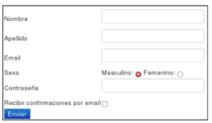

# tp2- Redes y Comunicaciones

---

1. ¿Cuál es la función de la capa de aplicación?
2. Si dos procesos deben comunicarse:
a. ¿Cómo podrían hacerlo si están en diferentes máquinas?
b. Y si están en la misma máquina, ¿qué alternativas existen?
3. Explique brevemente cómo es el modelo Cliente/Servidor. Dé un ejemplo de un sistema
Cliente/Servidor en la “vida cotidiana” y un ejemplo de un sistema informático que siga el
modelo Cliente/Servidor. ¿Conoce algún otro modelo de comunicación?
4. Describa la funcionalidad de la entidad genérica “Agente de usuario” o “User agent”.
5. ¿Qué son y en qué se diferencian HTML y HTTP?
6. HTTP tiene definido un formato de mensaje para los requerimientos y las respuestas.
(Ayuda: apartado “Formato de mensaje HTTP”, Kurose).
a. ¿Qué información de la capa de aplicación nos indica si un mensaje es de
requerimiento o de respuesta para HTTP? ¿Cómo está compuesta dicha
información?¿Para qué sirven las cabeceras?
    
    b. ¿Cuál es su formato? (Ayuda:
    [https://developer.mozilla.org/es/docs/Web/HTTP/Headers](https://developer.mozilla.org/es/docs/Web/HTTP/Headers))
    c. Suponga que desea enviar un requerimiento con la versión de HTTP 1.1 desde
    curl/7.74.0 a un sitio de ejemplo como [www.misitio.com](http://www.misitio.com/) para obtener el recurso
    /index.html. En base a lo indicado, ¿qué información debería enviarse mediante
    encabezados? Indique cómo quedaría el requerimiento.
    

7. Utilizando la VM, abra una terminal e investigue sobre el comando curl. Analice para qué
sirven los siguientes parámetros (-I, -H, -X, -s).
8. Ejecute el comando curl sin ningún parámetro adicional y acceda a
[www.redes.unlp.edu.ar](http://www.redes.unlp.edu.ar/). Luego responda: 
       a. ¿Cuántos requerimientos realizó y qué recibió? Pruebe redirigiendo la salida
       (>) del comando curl a un archivo con extensión html y abrirlo con un
       navegador.
       b. ¿Cómo funcionan los atributos href de los tags link e img en html?
       c. Para visualizar la página completa con imágenes como en un navegador,
       ¿alcanza con realizar un único requerimiento?
       d. ¿Cuántos requerimientos serían necesarios para obtener una página que
       tiene dos CSS, dos Javascript y tres imágenes? Diferencie cómo funcionaría
       un navegador respecto al comando curl ejecutado previamente.

 9. Ejecute a continuación los siguientes comandos:
      curl -v -s [www.redes.unlp.edu.ar](http://www.redes.unlp.edu.ar/) > /dev/null
      curl -I -v -s [www.redes.unlp.edu.ar](http://www.redes.unlp.edu.ar/)
       a. ¿Qué diferencias nota entre cada uno?
       b. ¿Qué ocurre si en el primer comando se quita la redirección a /dev/null? ¿Por
       qué no es necesaria en el segundo comando?
       c. ¿Cuántas cabeceras viajaron en el requerimiento? ¿Y en la respuesta?

10. ¿Qué indica la cabecera Date?

11. En HTTP/1.0, ¿cómo sabe el cliente que ya recibió todo el objeto solicitado de manera
completa? ¿Y en HTTP/1.1?

1. Investigue los distintos tipos de códigos de retorno de un servidor web y su significado.
Considere que los mismos se clasifican en categorías (2XX, 3XX, 4XX, 5XX)
2. Utilizando curl, realice un requerimiento con el método HEAD al sitio
[www.redes.unlp.edu.ar](http://www.redes.unlp.edu.ar/) e indique:
    a. ¿Qué información brinda la primera línea de la respuesta?
    b. ¿Cuántos encabezados muestra la respuesta?
    c. ¿Qué servidor web está sirviendo la página?
    d. ¿El acceso a la página solicitada fue exitoso o no?
    e. ¿Cuándo fue la última vez que se modificó la página?
    f. Solicite la página nuevamente con curl usando GET, pero esta vez indique que
    quiere obtenerla sólo si la misma fue modificada en una fecha posterior a la que
    efectivamente fue modificada. ¿Cómo lo hace? ¿Qué resultado obtuvo? ¿Puede
    explicar para qué sirve?

  14. Utilizando curl, acceda al sitio [www.redes.unlp.edu.ar/restringido/index.php](http://www.redes.unlp.edu.ar/restringido/index.php) y siga las
   instrucciones y las pistas que vaya recibiendo hasta obtener la respuesta final. Será de
   utilidad para resolver este ejercicio poder analizar tanto el contenido de cada página como
   los encabezados.

15. Utilizando la VM, realice las siguientes pruebas:
      a. Ejecute el comando ’curl [www.redes.unlp.edu.ar/extras/prueba-http-1-0.txt’](http://www.redes.unlp.edu.ar/extras/prueba-http-1-0.txt%E2%80%99) y
      copie la salida completa (incluyendo los dos saltos de línea del final).
      b. Desde la consola ejecute el comando telnet [www.redes.unlp.edu.ar](http://www.redes.unlp.edu.ar/) 80 y
      luego pegue el contenido que tiene almacenado en el portapapeles. ¿Qué
      ocurre luego de hacerlo?
      c. Repita el proceso anterior, pero copiando la salida del recurso
      /extras/prueba-http-1-1.txt. Verifique que debería poder pegar varias veces el
      mismo contenido sin tener que ejecutar el comando telnet nuevamente.

1. En base a lo obtenido en el ejercicio anterior, responda:
a. ¿Qué está haciendo al ejecutar el comando telnet?
b. ¿Qué método HTTP utilizó? ¿Qué recurso solicitó?
c. ¿Qué diferencias notó entre los dos casos? ¿Puede explicar por qué?
d. ¿Cuál de los dos casos le parece más eficiente? Piense en el ejercicio donde
analizó la cantidad de requerimientos necesarios para obtener una página
con estilos, javascripts e imágenes. El caso elegido, ¿puede traer asociado
algún problema?
2. En el siguiente ejercicio veremos la diferencia entre los métodos POST y GET. Para ello,
será necesario utilizar la VM y la herramienta Wireshark. Antes de iniciar considere:
■ Capture los paquetes utilizando la interfaz con IP 172.28.0.1. (Menú “Capture
->Options”. Luego seleccione la interfaz correspondiente y presione Start).

■ Para que el analizador de red sólo nos muestre los mensajes del protocolo http
introduciremos la cadena ‘http’ (sin las comillas) en la ventana de especificación de
filtros de visualización (display-filter). Si no hiciéramos esto veríamos todo el tráfico
que es capaz de capturar nuestra placa de red. De los paquetes que son
capturados, aquel que esté seleccionado será mostrado en forma detallada en la
    
    sección que está justo debajo. Como sólo estamos interesados en http ocultaremos
    toda la información que no es relevante para esta práctica (Información de trama,
    Ethernet, IP y TCP). Desplegar la información correspondiente al protocolo HTTP
    bajo la leyenda “Hypertext Transfer Protocol”.
    ■ Para borrar la cache del navegador, deberá ir al menú “Herramientas->Borrar
    historial reciente”. Alternativamente puede utilizar Ctrl+F5 en el navegador para
    forzar la petición HTTP evitando el uso de caché del navegador.
    ■ En caso de querer ver de forma simplificada el contenido de una comunicación http,
    utilice el botón derecho sobre un paquete HTTP perteneciente al flujo capturado y
    seleccione la opción Follow TCP Stream.
    
    a. Abra un navegador e ingrese a la URL: [www.redes.unlp.edu.ar](http://www.redes.unlp.edu.ar/) e ingrese al
    link en la sección “Capa de Aplicación” llamado “Métodos HTTP”. En la
    página mostrada se visualizan dos nuevos links llamados: Método GET y
    Método POST. Ambos muestran un formulario como el siguiente:
    
    
    
    b. Analice el código HTML
    c. Utilizando el analizador de paquetes Wireshark capture los paquetes
    enviados y recibidos al presionar el botón Enviar.
    d. ¿Qué diferencias detectó en los mensajes enviados por el cliente?
    e. ¿Observó alguna diferencia en el browser si se utiliza un mensaje u otro?
    
3. Investigue cuál es el principal uso que se le da a las cabeceras Set-Cookie y Cookie en
HTTP y qué relación tienen con el funcionamiento del protocolo HTTP.
4. ¿Cuál es la diferencia entre un protocolo binario y uno basado en texto? ¿De qué tipo
de protocolo se trata HTTP/1.0, HTTP/1.1 y HTTP/2?
5. Responder las siguientes preguntas:
a. ¿Qué función cumple la cabecera Host en HTTP 1.1? ¿Existía en HTTP 1.0?
¿Qué sucede en HTTP/2? (Ayuda:
    
    [https://undertow.io/blog/2015/04/27/An-in-depth-overview-of-HTTP2.html](https://undertow.io/blog/2015/04/27/An-in-depth-overview-of-HTTP2.html) para
    HTTP/2)
    b. En HTTP/1.1, ¿es correcto el siguiente requerimiento?
    GET /index.php HTTP/1.1
    User-Agent: curl/7.54.0
    c. ¿Cómo quedaría en HTTP/2 el siguiente pedido realizado en HTTP/1.1 si se
    está usando https?
    GET /index.php HTTP/1.1
    Host: [www.info.unlp.edu.ar](http://www.info.unlp.edu.ar/)
    

---

Ejercicio de Parcial
curl -X ?? [www.redes.unlp.edu.ar/](http://www.redes.unlp.edu.ar/)??

> HEAD /metodos/ HTTP/??
Host: www.redes.unlp.edu.ar
User-Agent: curl/7.54.0
< HTTP/?? 200 OK
< Server: nginx/1.4.6 (Ubuntu)
< Date: Wed, 31 Jan 2018 22:22:22 GMT
< Last-Modified: Sat, 20 Jan 2018 13:02:41 GMT
< Content-Type: text/html; charset=UTF-8
< Connection: close
a. ¿Qué versión de HTTP podría estar utilizando el servidor?
b. ¿Qué método está utilizando? Dicho método, ¿retorna el recurso completo
solicitado?
c. ¿Cuál es el recurso solicitado?
d. ¿El método funcionó correctamente?
e. Si la solicitud hubiera llevado un encabezado que diga:
If-Modified-Since: Sat, 20 Jan 2018 13:02:41 GMT
¿Cuál habría sido la respuesta del servidor web? ¿Qué habría hecho el
navegador en este caso?
> 

---

1- **¿Cuál es la función de la capa de aplicación?**

La capa de aplicación es la capa más alta del modelo OSI (y también del modelo TCP/IP) y su función principal es **proveer servicios de red directamente a las aplicaciones del usuario final**. En otras palabras, es la que permite que programas como navegadores web, clientes de correo, aplicaciones FTP, etc., puedan comunicarse a través de la red.

Algunas tareas clave que realiza esta capa son:

- Gestionar la **interfaz con el usuario**.
- Facilitar la **transferencia de datos** entre la aplicación y el protocolo de red.
- Proporcionar **servicios como autenticación, compresión, cifrado** y más, dependiendo de la aplicación.
- Usar protocolos como **HTTP, FTP, SMTP, DNS, POP3, IMAP**, entre otros.

Así que básicamente, sin esta capa no podríamos interactuar de forma cómoda con los servicios de red desde nuestras aplicaciones cotidianas.

---

## 2-Si dos procesos deben comunicarse:

### **a. ¿Cómo podrían hacerlo si están en diferentes máquinas?**

Cuando los procesos están en **diferentes máquinas**, la comunicación se da a través de una **red**, y para eso se utilizan protocolos de comunicación que operan sobre la pila de red (como TCP/IP). Las formas más comunes incluyen:

- **Sockets TCP/UDP**: son la forma clásica. Uno de los procesos abre un socket en un puerto específico y el otro se conecta a él usando la dirección IP y ese puerto.
- **HTTP/HTTPS**: a través de una API REST, por ejemplo. Uno de los procesos actúa como servidor web.
- **Mensajería orientada a mensajes**: con herramientas como **RabbitMQ**, **Kafka** o **MQTT**, muy útil cuando hay muchos procesos distribuidos.
- **RPC (Remote Procedure Call)** o **gRPC**: permiten invocar funciones o métodos de otro proceso como si fueran locales.

---

### **b. Y si están en la misma máquina, ¿qué alternativas existen?**

Cuando ambos procesos están en la **misma máquina**, se pueden usar mecanismos más directos y eficientes, como:

- **Sockets locales (UNIX Domain Sockets)**: como los sockets de red, pero más rápidos porque no pasan por la capa IP.
- **Memoria compartida (Shared Memory)**: ambos procesos acceden a una zona de memoria común. Muy rápido, pero requiere buena sincronización.
- **Pipes (tuberías)**:
    - **Pipes anónimos**: útiles para comunicación entre procesos padre e hijo.
    - **Named pipes (FIFO)**: funcionan como archivos especiales y permiten la comunicación entre procesos no relacionados.
- **Colas de mensajes del sistema operativo**: como las que ofrece POSIX o System V en sistemas UNIX.
- **Archivos temporales**: ambos procesos escriben y leen desde un archivo. Es más lento, pero a veces suficiente.

---

En resumen, si están en **máquinas diferentes**, se comunican por red; si están en la **misma máquina**, hay más opciones, y varias son más rápidas porque no dependen del sistema de red. 

**Pregunta 3: Explique brevemente cómo es el modelo Cliente/Servidor. Dé un ejemplo de un sistema Cliente/Servidor en la “vida cotidiana” y un ejemplo de un sistema informático que siga el modelo Cliente/Servidor. ¿Conoce algún otro modelo de comunicación?**

---

### **¿Qué es el modelo Cliente/Servidor?**

El modelo **Cliente/Servidor** es una arquitectura de comunicación donde un proceso (el **cliente**) solicita servicios o recursos, y otro proceso (el **servidor**) los proporciona. El servidor espera solicitudes, las procesa, y envía una respuesta.

Este modelo es **asimétrico**: el servidor suele estar encendido de forma permanente y puede atender múltiples clientes a la vez, mientras que los clientes se conectan cuando necesitan algo.

---

### **Ejemplo en la vida cotidiana:**

Una **panadería** funciona como un servidor:

- El cliente entra, hace su pedido (una factura, un pan).
- El panadero (el servidor) atiende el pedido y lo entrega.
- Varios clientes pueden hacer pedidos, pero el servidor centralizado (panadería) los procesa.

---

### **Ejemplo informático:**

Un **navegador web** (cliente) y un **servidor web** (por ejemplo, el servidor de Google):

- El navegador solicita una página web (como google.com).
- El servidor procesa el pedido y devuelve el contenido de la página.
- Este modelo se usa en casi todas las aplicaciones web: email, redes sociales, etc.

---

### **¿Conocés algún otro modelo de comunicación?**

Sí, otro modelo muy conocido es el de **Pares (Peer-to-Peer o P2P)**. En este caso:

- Todos los nodos pueden actuar **tanto como cliente como servidor**.
- No hay una jerarquía clara entre ellos.
- Ejemplo: redes de intercambio de archivos como **BitTorrent**, donde cada usuario comparte (sirve) y descarga (consume) archivos al mismo tiempo.

---

### **4. Describa la funcionalidad de la entidad genérica “Agente de usuario” o “User agent”.**

### **¿Qué es un “Agente de usuario” (User Agent)?**

Un **User Agent** es una **aplicación que actúa en nombre del usuario** para interactuar con servicios de red. Es la interfaz entre el usuario y la red o internet, permitiéndole enviar y recibir información.

---

### **¿Qué hace concretamente?**

- Interpreta y presenta la información que recibe (por ejemplo, una página web).
- Se comunica con servidores utilizando protocolos (como HTTP, IMAP, SMTP, etc.).
- Acompaña sus solicitudes con información identificatoria (como el *user-agent string*) que describe el software, sistema operativo, versión, etc.

---

### **Ejemplos de User Agents:**

- **Navegadores web**: como Firefox, Chrome, Safari. Usan HTTP/HTTPS para comunicarse con servidores.
- **Clientes de correo electrónico**: como Outlook o Thunderbird, que usan protocolos como IMAP y SMTP.
- **Aplicaciones móviles**: que hacen solicitudes HTTP para interactuar con servicios en la nube.
- Incluso herramientas en línea de comandos como `curl` o `wget` también actúan como user agents.

---

En resumen: el **User Agent** es la "cara visible" del usuario en la red, su representante digital. Se encarga de manejar las comunicaciones con los servidores y de presentar la información al usuario de forma entendible.

### 5. ¿Qué son y en qué se diferencian HTML y HTTP?

### **¿Qué es HTML?**

**HTML** (HyperText Markup Language) es un **lenguaje de marcado** que se utiliza para **estructurar y presentar contenido** en la web. Define cómo deben mostrarse los textos, imágenes, enlaces, tablas, formularios, etc.

📄 **Ejemplo**:

```html
<h1>Bienvenido a mi página</h1>
<p>Este es un párrafo de ejemplo.</p>

```

HTML **no es un protocolo** ni se encarga de enviar datos: simplemente **describe el contenido**.

---

### **¿Qué es HTTP?**

**HTTP** (HyperText Transfer Protocol) es un **protocolo de comunicación** que permite **la transferencia de datos** entre un cliente (como un navegador) y un servidor web.

📡 Por ejemplo:

- Cuando escribís `www.google.com`, el navegador hace una **solicitud HTTP** al servidor.
- El servidor responde con un archivo HTML, que luego se muestra en el navegador.

HTTP **no define cómo se ve el contenido**, sino **cómo se transmite**.

---

### **¿En qué se diferencian?**

| Característica | HTML | HTTP |
| --- | --- | --- |
| Tipo | Lenguaje de marcado | Protocolo de comunicación |
| Función | Estructura y contenido de las páginas | Transferencia de datos entre cliente/servidor |
| Ejemplo de uso | `<h1>Hola Mundo</h1>` | `GET /index.html HTTP/1.1` |
| ¿Qué hace? | Da formato y orden al contenido | Envía y recibe recursos como HTML, imágenes, etc. |

---

💡 **Resumen cortito y al pie**:

- **HTML**: *¿Qué se muestra y cómo?*
- **HTTP**: *¿Cómo se lo pido al servidor y cómo lo recibo?*

### 6. HTTP tiene definido un formato de mensaje para los requerimientos y las respuestas.
(Ayuda: apartado “Formato de mensaje HTTP”, Kurose).
a. ¿Qué información de la capa de aplicación nos indica si un mensaje es de requerimiento o de respuesta para HTTP? ¿Cómo está compuesta dicha
información?¿Para qué sirven las cabeceras?

### **a. ¿Qué información de la capa de aplicación nos indica si un mensaje es de requerimiento o de respuesta para HTTP?**

En el protocolo HTTP, la **diferencia clave entre un requerimiento y una respuesta** está en la **línea inicial del mensaje**, que es distinta para cada tipo:

---

### ✅ **1. Mensaje de Requerimiento (Request)**

La **línea inicial** de un mensaje de requerimiento tiene la forma:

```
<Método> <Ruta recurso> <Versión HTTP>

```

Ejemplo:

```
GET /index.html HTTP/1.1

```

- `GET`: es el **método** (también puede ser POST, PUT, DELETE, etc.).
- `/index.html`: es la **ruta** del recurso que se quiere acceder.
- `HTTP/1.1`: es la **versión del protocolo**.

Esto nos indica que el cliente está solicitando un recurso.

---

### ✅ **2. Mensaje de Respuesta (Response)**

La **línea inicial** de una respuesta tiene esta forma:

```
<Versión HTTP> <Código de estado> <Frase descriptiva>

```

Ejemplo:

```
HTTP/1.1 200 OK

```

- `HTTP/1.1`: versión del protocolo.
- `200`: código de estado (hay muchos: 200, 404, 403, 500...).
- `OK`: descripción breve del código.

Esto indica que el servidor está **respondiendo** a una solicitud previa.

---

### 🧾 **¿Para qué sirven las cabeceras (headers)?**

Las **cabeceras** son líneas adicionales que van después de la línea inicial, separadas por `:`. Sirven para **transmitir metadatos** sobre la solicitud o respuesta. Algunas funciones:

- **Identificar al cliente o servidor**:
    
    `User-Agent`, `Server`
    
- **Controlar el formato** del contenido:
    
    `Content-Type`, `Content-Length`
    
- **Manejo de cache y autenticación**:
    
    `Cache-Control`, `Authorization`
    
- **Idioma, codificación, cookies, etc.**:
    
    `Accept-Language`, `Set-Cookie`, `Encoding`, etc.
    

---

### 🧠 **Resumen corto:**

| Tipo de mensaje | Línea inicial | ¿Para qué sirve? |
| --- | --- | --- |
| Requerimiento | `GET /recurso HTTP/1.1` | Inicia una solicitud |
| Respuesta | `HTTP/1.1 200 OK` | Informa el resultado de la solicitud |
| Cabeceras | `Clave: Valor` | Aportan detalles técnicos y de control |

### **6.b. ¿Cuál es su formato (de los mensajes HTTP)?**

Un **mensaje HTTP**, ya sea de requerimiento o de respuesta, sigue esta estructura general:

---

### ✅ **Formato de un requerimiento HTTP:**

```
<Método> <Ruta> <Versión>
Cabecera-1: Valor-1
Cabecera-2: Valor-2
...

<Cuerpo del mensaje> (opcional)

```

📌 **Ejemplo simple:**

```
GET /index.html HTTP/1.1
Host: www.misitio.com
User-Agent: curl/7.74.0
Accept: */*

```

---

### ✅ **Formato de una respuesta HTTP:**

```
<Versión> <Código de estado> <Mensaje>
Cabecera-1: Valor-1
Cabecera-2: Valor-2
...

<Cuerpo del mensaje> (contenido del recurso)

```

📌 **Ejemplo:**

```
HTTP/1.1 200 OK
Content-Type: text/html
Content-Length: 128

<html>
  <body>Hola Nahuel</body>
</html>

```

---

### **6.c. Simulación de un requerimiento HTTP con `curl` a [www.misitio.com](http://www.misitio.com/)**

Vos querés hacer un **GET** a `/index.html` usando `curl/7.74.0`, y respetando la especificación de **HTTP/1.1**.

---

### 🔧 **Encabezados obligatorios (mínimos):**

- `GET /index.html HTTP/1.1` → método y ruta.
- `Host: www.misitio.com` → obligatorio en HTTP/1.1.
- `User-Agent: curl/7.74.0` → identifica el cliente.
- `Accept: */*` → indica que el cliente acepta cualquier tipo de contenido.

---

### ✅ **Así quedaría el requerimiento HTTP completo:**

```
GET /index.html HTTP/1.1
Host: www.misitio.com
User-Agent: curl/7.74.0
Accept: */*

```

💡 Esto es lo que efectivamente **envía `curl`** si hacés:

```bash
curl -v http://www.misitio.com/index.html

```

Y más crudo aún:

```bash
curl -v --http1.1 http://www.misitio.com/index.html

```

### 7. Utilizando la VM, abra una terminal e investigue sobre el comando curl. Analice para qué
sirven los siguientes parámetros (-I,-H,-X,-s).

### 📌 ¿Qué es `curl`?

Es una herramienta de línea de comandos para transferir datos desde o hacia un servidor, usando protocolos como HTTP, HTTPS, FTP, etc. Muy útil para probar APIs, hacer peticiones a sitios web, y más.

---

### 🔍 Parámetros que te piden:

### 🔹 `I` (mayúscula)

**Significa:** `--head`

**¿Para qué sirve?:**

Hace una petición **solo por las cabeceras HTTP**, sin descargar el cuerpo del contenido.

🧪 Ejemplo:

```bash
curl -I https://www.google.com

```

**Salida esperada:**

```
HTTP/2 200
date: Mon, 08 Apr 2025 23:59:59 GMT
content-type: text/html; charset=ISO-8859-1
...

```

---

### 🔹 `H` (mayúscula)

**Significa:** `--header`

**¿Para qué sirve?:**

Permite **agregar cabeceras personalizadas** a la solicitud HTTP. Muy útil para simular navegadores, enviar tokens, o probar APIs.

🧪 Ejemplo:

```bash
curl -H "User-Agent: NahuelBrowser/1.0" https://example.com

```

---

### 🔹 `X`

**¿Para qué sirve?:**

Permite especificar el **método HTTP** a usar: `GET`, `POST`, `PUT`, `DELETE`, etc. Por defecto, `curl` usa `GET`.

🧪 Ejemplo:

```bash
curl -X POST https://api.ejemplo.com/crear

```

También podés combinarlo con `-d` para enviar datos.

---

### 🔹 `s` (minúscula)

**Significa:** `--silent`

**¿Para qué sirve?:**

Silencia la salida de progreso y errores de `curl`. Solo muestra el contenido recibido (útil en scripts o para obtener salida limpia).

🧪 Ejemplo:

```bash
curl -s https://example.com

```

---

### 💡 Bonus Tip: Combinarlos

Podés combinarlos para hacer cosas como esta:

```bash
curl -s -I -H "Host: www.misitio.com" -X GET http://108.61.73.182

```

---

## 🧾 Tabla resumen – Parámetros de `curl`

| Parámetro | Nombre largo | Función principal | Ejemplo |
| --- | --- | --- | --- |
| `-I` | `--head` | Pide **solo las cabeceras** del recurso | `curl -I https://www.google.com` |
| `-H` | `--header` | Agrega **cabeceras personalizadas** | `curl -H "User-Agent: NahuelBrowser/1.0" example.com` |
| `-X` | *(sin alias largo)* | Especifica el **método HTTP** a usar (GET, POST, etc) | `curl -X POST https://api.ejemplo.com/recurso` |
| `-s` | `--silent` | Ejecuta sin mostrar barra de progreso o errores | `curl -s https://example.com` |

---

## 🧪 Práctica paso a paso

### 🔹 1. Ver solo las cabeceras de un sitio:

```bash
curl -I https://www.wikipedia.org

```

👉 Deberías ver líneas como:

```
HTTP/2 200
content-type: text/html; charset=UTF-8
...

```

---

### 🔹 2. Enviar una cabecera personalizada:

```bash
curl -H "User-Agent: NahuelTest/1.0" https://httpbin.org/headers

```

👉 Te devuelve algo como:

```json
{
  "headers": {
    "User-Agent": "NahuelTest/1.0",
    ...
  }
}

```

---

### 🔹 3. Probar un método POST:

```bash
curl -X POST https://httpbin.org/post

```

👉 El servidor te responde confirmando que recibió un `POST`.

---

### 🔹 4. Silenciar todo menos el contenido:

```bash
curl -s https://www.example.com

```

👉 No muestra barra de progreso ni errores, solo el HTML de la página.

---

### 🧠 Extra: Combiná todo en una sola línea

```bash
curl -s -X GET -H "User-Agent: NahuelTest/1.0" https://httpbin.org/get

```

---

1. **Ejecute el comando curl sin ningún parámetro adicional y acceda a
[www.redes.unlp.edu.ar](http://www.redes.unlp.edu.ar/). Luego responda:**

---

### **🧪 a. ¿Cuántos requerimientos realizó y qué recibió?**

- Usaste: `curl -v www.redes.unlp.edu.ar`
- En el log ves:
    
    ```
    *   Trying 172.28.0.50:80...
    * Connected...
    > GET / HTTP/1.1
    
    ```
    
- ✅ Realizó **un solo requerimiento** HTTP tipo `GET /`
- 📦 Recibiste: el contenido HTML completo de la página principal (`index.html`), incluyendo todo el texto, estructura y enlaces.

✅ Si querés redirigir ese contenido a un archivo y abrirlo con el navegador:

```bash
curl www.redes.unlp.edu.ar > ~/pagina.html
xdg-open ~/pagina.html  # o doble clic desde el entorno gráfico

```

---

### **🧷 b. ¿Cómo funcionan los atributos `href` y `src` de los tags `<link>` e ``?**

- `<link href="archivo.css">` → se usa para **incluir archivos externos** como CSS, fuentes, etc.
- `` → define de dónde cargar una **imagen**

💡 Ambos hacen que el **navegador realice nuevas solicitudes HTTP** para obtener esos archivos adicionales.

---

### **🌐 c. ¿Alcanza con un solo requerimiento para ver la página completa como en un navegador?**

❌ No. Un solo `curl` trae solo el HTML, pero **no descarga los archivos referenciados** (CSS, JS, imágenes...).

🔁 Para ver la página como un navegador, necesitás varios requerimientos adicionales para cada recurso externo referenciado en el HTML.

---

### **📊 d. ¿Cuántos requerimientos serían necesarios para una página con: 2 CSS, 2 JS y 3 imágenes?**

- 🔢 Total: `1 (HTML)` + `2 (CSS)` + `2 (JS)` + `3 (Imágenes)` = **8 requerimientos**

---

### 🆚 ¿Cómo actúa el navegador VS `curl`?

| Acción | Navegador | `curl` |
| --- | --- | --- |
| HTML principal | ✅ Sí | ✅ Sí |
| Archivos CSS/JS | ✅ Sí, los detecta y los pide | ❌ No los pide automáticamente |
| Imágenes | ✅ Sí, hace un request por cada una | ❌ No los pide |
| Procesamiento | ✅ Interpreta HTML, JS, CSS, etc. | ❌ Solo descarga texto (sin interpretar) |

---

### 🧠 Entonces, lo que define **si se hace un request HTTP o no**, no es solo la barra `/`, sino **desde qué protocolo estás cargando la página (http vs file)**.

Te dejo esta regla de oro:

> 🧪 Si el HTML se carga por http:// → cualquier recurso (css, img, etc.) también será por HTTP.
> 
> 
> 📁 **Si el HTML se abre con `file://` → los recursos se buscan en el sistema de archivos local.**
> 

**9 Ejecute a continuación los siguientes comandos:**
   curl-v-s [www.redes.unlp.edu.ar](http://www.redes.unlp.edu.ar/) > /dev/null
   curl-I-v-s [www.redes.unlp.edu.ar](http://www.redes.unlp.edu.ar/)

### 🧪 Comandos ejecutados:

```bash
curl -v -s www.redes.unlp.edu.ar > /dev/null
curl -I -v -s www.redes.unlp.edu.ar
```

---

### a. ¿Qué diferencias nota entre cada uno?

- **Primer comando**: `curl -v -s www.redes.unlp.edu.ar > /dev/null`
    - Hace un **GET completo** a la página.
    - Con `s` se ocultan errores y barra de progreso.
    - Con `v` muestra el detalle de la **conexión, headers enviados y recibidos**.
    - Redirige la salida del **cuerpo HTML** a `/dev/null`, por eso no lo ves en pantalla.
    - 🔁 **Recibe y descarta el contenido**, solo ves los headers y logs.
- **Segundo comando**: `curl -I -v -s www.redes.unlp.edu.ar`
    - El flag `I` indica que haga un **HEAD** en lugar de un GET → pide **solo los headers**, sin el cuerpo del HTML.
    - También muestra la parte verbose (`v`) con el detalle del request y la respuesta.
    - Como **no hay cuerpo**, **no necesitás redirigir a `/dev/null`**, porque no devuelve contenido HTML.

---

### b. ¿Qué ocurre si en el primer comando se quita la redirección a `/dev/null`?

- Te va a mostrar el **HTML completo** en consola.
- Es útil si querés ver el contenido, pero puede ser molesto si solo querés analizar headers.
- En cambio, en el segundo comando (`I`) **no hay HTML que redirigir**, porque solo devuelve headers, por eso no hace falta el `> /dev/null`.

---

### c. ¿Cuántas cabeceras viajaron en el requerimiento? ¿Y en la respuesta?

### 📤 En el **requerimiento** (GET o HEAD):

Se ven estas 4 cabeceras:

1. `GET / HTTP/1.1` (o `HEAD / HTTP/1.1` con `I`)
2. `Host: www.redes.unlp.edu.ar`
3. `User-Agent: curl/7.74.0`
4. `Accept: */*`

### 📥 En la **respuesta** del servidor:

Se observan 7 headers:

1. `HTTP/1.1 200 OK`
2. `Date: ...`
3. `Server: Apache/...`
4. `Last-Modified: ...`
5. `ETag: ...`
6. `Accept-Ranges: bytes`
7. `Content-Length: 4898`
8. `Content-Type: text/html`

---

**10.
La cabecera `Date` en una respuesta HTTP indica la fecha y hora exactas en las que el servidor generó esa respuesta.**

---

### 📌 Ejemplo:

```
Date: Tue, 08 Apr 2025 23:06:54 GMT

```

---

### 🔎 ¿Para qué sirve?

- Le dice al cliente (navegador, curl, etc.) **cuándo se produjo esa respuesta**.
- Es útil para **cachear contenido**: los navegadores pueden compararla con otras cabeceras como `Last-Modified` o `Expires` para decidir si volver a pedir el contenido o usar una copia guardada.
- También sirve para **sincronizar relojes** en algunos casos o para análisis de logs.

---

**11 En HTTP/1.0, ¿cómo sabe el cliente que ya recibió todo el objeto solicitado de manera
completa? ¿Y en HTTP/1.1?**

---

### **HTTP/1.0**

🔸 **¿Cómo sabe el cliente que recibió todo el objeto?**

👉 El servidor **cierra la conexión TCP** una vez que termina de enviar el contenido.

Entonces, el cliente interpreta que ya recibió todo **cuando se corta la conexión**.

---

### **HTTP/1.1**

🔸 En esta versión, la conexión puede **quedar abierta** (persistente) para permitir múltiples pedidos/respuestas sobre la misma conexión (lo que mejora el rendimiento).

👉 Por eso, el servidor indica **cuánto contenido va a enviar** usando la cabecera:

```
Content-Length: <tamaño en bytes>

```

De esa forma, el cliente sabe cuándo termina el cuerpo de la respuesta **sin necesidad de cerrar la conexión**.

✅ También existen mecanismos como **chunked transfer encoding** para casos donde no se conoce el tamaño de antemano, pero eso es más avanzado.

---

1. **Investigue los distintos tipos de códigos de retorno de un servidor web y su significado.
Considere que los mismos se clasifican en categorías (2XX, 3XX, 4XX, 5XX).**

### **Códigos de retorno de un servidor web**

Los **códigos de estado HTTP** indican el resultado de la solicitud que realiza un cliente al servidor. Se clasifican en **cinco categorías principales**, según su primer dígito:

---

### 🔵 **1xx – Informativos**

El servidor **recibió la solicitud** y continúa procesándola.

- **100 Continue**: El cliente puede seguir con la solicitud.
- **101 Switching Protocols**: El servidor acepta cambiar de protocolo (por ejemplo, a WebSocket).

---

### 🟢 **2xx – Éxito**

La solicitud fue **procesada correctamente**.

- **200 OK**: Todo bien, el contenido se entrega como se pidió.
- **201 Created**: Recurso creado exitosamente (por ejemplo, al hacer un POST).
- **204 No Content**: Solicitud exitosa pero sin contenido para devolver.

---

### 🟡 **3xx – Redirección**

Se requiere una **acción adicional** para completar la solicitud (como seguir otra URL).

- **301 Moved Permanently**: El recurso fue movido de forma permanente.
- **302 Found**: Redirección temporal.
- **304 Not Modified**: El recurso no ha cambiado desde la última vez (útil con caché).

---

### 🔴 **4xx – Error del cliente**

La solicitud es inválida por parte del cliente.

- **400 Bad Request**: Sintaxis inválida.
- **401 Unauthorized**: Falta autenticación.
- **403 Forbidden**: Acceso denegado, aunque estés autenticado.
- **404 Not Found**: Recurso no encontrado.
- **405 Method Not Allowed**: Método HTTP no permitido (por ejemplo, un POST donde solo se permite GET).

---

### ⚫ **5xx – Error del servidor**

El servidor falló al procesar una solicitud válida.

- **500 Internal Server Error**: Error genérico del servidor.
- **501 Not Implemented**: El servidor no reconoce el método de la solicitud.
- **502 Bad Gateway**: El servidor recibió una respuesta inválida desde otro servidor.
- **503 Service Unavailable**: El servidor está temporalmente fuera de servicio (sobrecarga o mantenimiento).

---

## 📄 **Resumen de Códigos de Estado HTTP**

| **Código** | **Categoría** | **Significado** |
| --- | --- | --- |
| **1xx** | 🔵 *Informativos* | El servidor recibió la solicitud y continúa procesándola. |
| **100** | Continue | El cliente puede continuar con la solicitud. |
| **101** | Switching Protocols | El servidor acepta cambiar de protocolo (ej: WebSocket). |

---

| **2xx**    | 🟢 *Éxito*                | La solicitud fue procesada correctamente.                                       |
| **200**    | OK                       | Todo bien, respuesta satisfactoria.                                             |
| **201**    | Created                  | Recurso creado exitosamente.                                                   |
| **204**    | No Content               | Solicitud exitosa, sin contenido para devolver.                                |

---

| **3xx**    | 🟡 *Redirección*          | El recurso fue movido o requiere una acción adicional.                         |
| **301**    | Moved Permanently        | El recurso cambió de dirección de forma permanente.                            |
| **302**    | Found                    | Redirección temporal.                                                          |
| **304**    | Not Modified             | El recurso no cambió desde la última vez (usado con caché).                    |

---

| **4xx**    | 🔴 *Error del Cliente*    | Problemas en la solicitud del cliente.                                         |
| **400**    | Bad Request              | Solicitud malformada.                                                          |
| **401**    | Unauthorized             | Requiere autenticación.                                                        |
| **403**    | Forbidden                | Acceso denegado.                                                               |
| **404**    | Not Found                | Recurso no encontrado.                                                         |
| **405**    | Method Not Allowed       | Método HTTP no permitido.                                                     |

---

| **5xx**    | ⚫ *Error del Servidor*   | El servidor falló al procesar una solicitud válida.                            |
| **500**    | Internal Server Error    | Error genérico del servidor.                                                  |
| **501**    | Not Implemented          | Método HTTP no reconocido.                                                    |
| **502**    | Bad Gateway              | Respuesta inválida desde otro servidor.                                       |
| **503**    | Service Unavailable      | El servidor no puede responder (sobrecarga o mantenimiento).                  |

---

1. U**tilizando curl, realice un requerimiento con el método HEAD al sitio
[www.redes.unlp.edu.ar](http://www.redes.unlp.edu.ar/) e indique:**

 `curl -I www.redes.unlp.edu.ar`.

---

### ✅ 13. Respuestas:

### a. **¿Qué información brinda la primera línea de la respuesta?**

```
HTTP/1.1 200 OK

```

- **HTTP/1.1**: Es la versión del protocolo HTTP que se está usando.
- **200 OK**: Es el **código de estado** que indica que la solicitud fue procesada correctamente (respuesta exitosa).

---

### b. **¿Cuántos encabezados muestra la respuesta?**

Contemos las líneas siguientes a la de estado:

1. `Date`
2. `Server`
3. `Last-Modified`
4. `ETag`
5. `Accept-Ranges`
6. `Content-Length`
7. `Content-Type`

🧮 **Total: 7 encabezados**

---

### c. **¿Qué servidor web está sirviendo la página?**

```
Server: Apache/2.4.53 (Unix)

```

➡️ El servidor es **Apache**, versión **2.4.53**, ejecutándose en un sistema tipo **Unix**.

---

### d. **¿El acceso a la página solicitada fue exitoso o no?**

Sí, fue exitoso.

- Lo confirma el código de estado: `200 OK`.

---

### e. **¿Cuándo fue la última vez que se modificó la página?**

```
Last-Modified: Wed, 13 Apr 2022 22:55:32 GMT

```

➡️ La última modificación fue el **13 de abril de 2022 a las 22:55:32 GMT**.

---

### f. **Solicite la página nuevamente con curl usando GET, pero esta vez indique que quiere obtenerla sólo si la misma fue modificada en una fecha posterior a la que efectivamente fue modificada. ¿Cómo lo hace? ¿Qué resultado obtuvo? ¿Puede explicar para qué sirve?**

### 📌 Comando:

```bash
curl -v -H "If-Modified-Since: Wed, 14 Apr 2022 00:00:00 GMT" www.redes.unlp.edu.ar

```

> Le decimos al servidor: "dame la página solo si fue modificada después del 14 de abril de 2022".
> 

---

### ✅ Resultado esperado:

```
HTTP/1.1 304 Not Modified

```

- Esto indica que **no fue modificada** desde la fecha indicada.
- Por lo tanto, **no se descarga el cuerpo** de la página. Solo se recibe ese código de estado.

---

### 🎯 ¿Para qué sirve?

- **Ahorra ancho de banda** y mejora el rendimiento, porque evita descargar contenido innecesario.
- Es parte del mecanismo de **caché HTTP**, útil para navegadores y proxies.

---

1. Utilizando curl, acceda al sitio [www.redes.unlp.edu.ar/restringido/index.php](http://www.redes.unlp.edu.ar/restringido/index.php) y siga las
instrucciones y las pistas que vaya recibiendo hasta obtener la respuesta final. Será de
utilidad para resolver este ejercicio poder analizar tanto el contenido de cada página como
los encabezados.
SI 👍

 

1. Utilizando la VM, realice las siguientes pruebas:
a. Ejecute el comando ’curl [www.redes.unlp.edu.ar/extras/prueba-http-1-0.txt’](http://www.redes.unlp.edu.ar/extras/prueba-http-1-0.txt%E2%80%99) y
copie la salida completa (incluyendo los dos saltos de línea del final).

    
    
    
    b. Desde la consola ejecute el comando telnet [www.redes.unlp.edu.ar](http://www.redes.unlp.edu.ar/) 80 y
    luego pegue el contenido que tiene almacenado en el portapapeles. ¿Qué
    ocurre luego de hacerlo?
    
    - HTTP/1.0 **cierra la conexión después de cada request** → tenés que volver a ejecutar `telnet` para hacer otro pedido.
    
    c. Repita el proceso anterior, pero copiando la salida del recurso
    /extras/prueba-http-1-1.txt. Verifique que debería poder pegar varias veces el
    mismo contenido sin tener que ejecutar el comando telnet nuevamente.
    
    ### ✅ **Objetivo de la parte c**:
    
    Vas a pedir el contenido de `prueba-http-1-1.txt`, copiar esa solicitud, y ver cómo HTTP/1.1 permite mantener la conexión abierta para reutilizarla, a diferencia de HTTP/1.0 que la cierra.
    
    ---
    
    ## 🧪 Parte C – Paso a paso:
    
    ### 1. **Hacé un curl al recurso HTTP/1.1 y copiá la solicitud**
    
    Ejecutá este comando en la terminal:
    
    ```bash
    curl www.redes.unlp.edu.ar/extras/prueba-http-1-1.txt
    
    ```
    
    Eso te va a devolver algo como esto (la solicitud cruda que harías con `telnet`):
    
    ```
    GET /extras/prueba-http-1-1.txt HTTP/1.1
    Host: www.redes.unlp.edu.ar
    User-Agent: curl/7.38.0
    Accept: */*
    
    ```
    
    ⚠️ **Acordate de copiar también los dos saltos de línea al final**, o sea, la línea en blanco que indica el final del request HTTP.
    
    ---
    
    ### 2. **Entrá por telnet al servidor**
    
    ```bash
    telnet www.redes.unlp.edu.ar 80
    
    ```
    
    Cuando diga `Connected to www.redes.unlp.edu.ar`, **pegá** el contenido copiado (la solicitud completa).
    
    💡 Te debería responder con el contenido del recurso (`HTTP/1.1 200 OK`, headers, y el texto).
    
    ---
    
    ### 3. **Volvé a pegar la solicitud (sin cerrar telnet)**
    
    Copiá de nuevo el mismo bloque de texto (la solicitud HTTP) y pegalo otra vez.
    
    📌 Si todo va bien, **el servidor va a responder de nuevo sin necesidad de reconectar**, gracias a que HTTP/1.1 **mantiene viva la conexión** (lo que se llama *persistent connection*).
    
    ---
    
    ## 🎯 ¿Cuál es la diferencia clave con HTTP/1.0?
    
    - HTTP/1.0 **cierra la conexión después de cada request** → tenés que volver a ejecutar `telnet` para hacer otro pedido.
    - HTTP/1.1 **mantiene la conexión abierta por defecto** → podés enviar varias solicitudes por la misma sesión de `telnet`.
    
    ---
    

1**6.**

---

### **✅ 16. En base a lo obtenido en el ejercicio anterior, responda:**

---

### a. **¿Qué está haciendo al ejecutar el comando `telnet`?**

Con `telnet www.redes.unlp.edu.ar 80`, estás **estableciendo una conexión TCP directa con el puerto 80 del servidor web**, o sea, el puerto por defecto para HTTP.

Esto te permite **enviar manualmente un pedido HTTP**, como si fueras un navegador o `curl`, pero de forma "cruda" y sin automatizaciones.

---

### b. **¿Qué método HTTP utilizó? ¿Qué recurso solicitó?**

Usaste el método **`GET`**, que sirve para pedir recursos al servidor.

Y los recursos que solicitaste fueron:

- `/extras/prueba-http-1-0.txt` (con HTTP/1.0)
- `/extras/prueba-http-1-1.txt` (con HTTP/1.1)

Ambos son archivos de texto en el servidor de la cátedra.

---

### c. **¿Qué diferencias notó entre los dos casos? ¿Puede explicar por qué?**

💡 **Diferencia clave: el manejo de la conexión**

- **Con HTTP/1.0**: Después de enviar el primer request, el servidor te responde y **cierra la conexión** automáticamente.
    
    ➤ Para enviar otro pedido, **tenés que salir y volver a entrar con `telnet`**.
    
- **Con HTTP/1.1**: La conexión **se mantiene abierta por defecto**.
    
    ➤ Podés **enviar múltiples pedidos seguidos** sin reconectar, porque HTTP/1.1 implementa *persistent connections*.
    

📎 Esto pasa porque HTTP/1.1 **mantiene la conexión viva salvo que digas lo contrario** (con `Connection: close`), mientras que HTTP/1.0 cierra por defecto.

---

### d. **¿Cuál de los dos casos le parece más eficiente?**

🔝 **HTTP/1.1 es claramente más eficiente**, especialmente cuando una página web requiere varios recursos (HTML + CSS + JS + imágenes).

Ejemplo: si una página necesita 10 archivos, con HTTP/1.0 serían **10 conexiones nuevas**.

En cambio, con HTTP/1.1 podés **usar la misma conexión para los 10 pedidos**, lo que ahorra tiempo y recursos.

---

### ❗¿Tiene algún problema HTTP/1.1?

Sí, aunque es más eficiente, **puede tener problemas si se abren muchas conexiones persistentes** y no se gestionan bien:

- Si no se cierran explícitamente, pueden **quedar abiertas mucho tiempo** y **consumir recursos del servidor** (memoria, sockets).
- En conexiones lentas o con muchos clientes simultáneos, esto puede escalar mal.

📦 Por eso más adelante surgió HTTP/2, que mejora aún más el manejo de múltiples recursos con multiplexación.

---

tabla clara para comparar **HTTP/1.0** vs **HTTP/1.1** 👇

---

### 🔍 Comparativa HTTP/1.0 vs HTTP/1.1

| Característica | HTTP/1.0 | HTTP/1.1 |
| --- | --- | --- |
| 📡 Versión de protocolo | 1.0 | 1.1 |
| 🔁 Persistencia de conexión | ❌ No (cierra por defecto) | ✅ Sí (por defecto la conexión queda abierta) |
| 🔄 Reutilización de conexión | ❌ No | ✅ Sí |
| 🧠 Soporte de cabeceras `Host` | ❌ No obligatorio | ✅ Obligatorio |
| ⚙️ Eficiencia en múltiples recursos | Baja (una conexión por recurso) | Alta (una conexión para varios recursos) |
| ⛔ Problemas comunes | Muchas conexiones lentas | Conexiones colgadas si no se cierran |
| 💡 Necesidad de reconexión | Cada vez que se hace un nuevo pedido | Solo si la conexión se cierra explícitamente |
| 🧩 Compatibilidad con navegadores | Antiguo, ya no usado en producción | Estándar actual hasta HTTP/2 |

---

 mini esquema visual con los flujos de conexión en ambos casos (1.0 vs 1.1)


1. 

---

### 🧠 ¿Qué busca que aprendas este punto?

Este ejercicio está pensado para que entiendas la **diferencia práctica entre los métodos HTTP GET y POST**, y cómo se **transmiten los datos** desde un formulario web al servidor.

---

### 🔎 ¿Qué hacen GET y POST? ¿Cuál es la diferencia?

Supongamos que estás llenando este formulario:

```
Nombre: Nahuel
Apellido: González
Email: nahuel@ejemplo.com
Sexo: Masculino
Contraseña: abc123

```

### ✅ Método GET

- Toda esa info que completás en el formulario **se envía en la URL**, así:
    
    ```
    www.redes.unlp.edu.ar/registro?nombre=Nahuel&apellido=González&email=nahuel@ejemplo.com...
    
    ```
    
- **Características**:
    - Visible en la barra del navegador.
    - Se puede guardar como link (bookmark).
    - **No es seguro** para datos sensibles (como contraseñas).
    - Limitado en cantidad de caracteres.

### ✅ Método POST

- La información **no viaja en la URL**, sino en el **cuerpo del mensaje HTTP** (invisible para el usuario).
- **Características**:
    - No se ve en la URL.
    - Más seguro para enviar datos privados (como contraseñas).
    - No tiene límite práctico de tamaño.
    - No se puede guardar como link directo.

---

### 🧪 ¿Qué harías con Wireshark y qué verías?

Wireshark es un programa para **capturar el tráfico de red**. Si lo usaras como en la guía:

1. Filtrarías por protocolo HTTP para no ver tráfico de más (`http` en el display filter).
2. Al enviar un formulario:
    - Con **GET**, verías los datos dentro de la línea `GET /registro?nombre=Nahuel...`
    - Con **POST**, verías la línea `POST /registro` y el cuerpo con los datos enviados separados.

🔍 En Wireshark podés ver el contenido exacto que el navegador le manda al servidor. Eso te permite analizar diferencias como:

- Dónde se mandan los datos.
- Qué headers se usan.
- Cómo el servidor responde a cada tipo de mensaje.

---

### ⚖️ ¿Qué conocimiento te llevás?

- GET y POST **sirven para enviar información**, pero:
    - GET es más simple, pero menos seguro.
    - POST es más privado, ideal para enviar datos como contraseñas.
- Herramientas como Wireshark te permiten **ver exactamente cómo viaja esa info por la red**, lo cual es clave si estás estudiando redes o seguridad informática.

---

## 📦 Ejemplo de mensaje HTTP con **GET**

Supongamos que llenás el formulario con estos datos:

```
Nombre: Nahuel
Apellido: Pérez
Email: nahuel@gmail.com
Sexo: Masculino
Contraseña: 1234

```

Y usás el método **GET**. El navegador mandaría algo así:

```
GET /formulario?nombre=Nahuel&apellido=Pérez&email=nahuel@gmail.com&sexo=Masculino&contrasena=1234 HTTP/1.1
Host: www.redes.unlp.edu.ar
User-Agent: Mozilla/5.0 (...)
Accept: text/html

```

📌 **Todo viaja en la URL**. Cualquiera que vea tu historial o lo capture en la red puede ver esos datos. Por eso **no se usa GET para contraseñas** ni info sensible.

---

## 📦 Ejemplo de mensaje HTTP con **POST**

Con el mismo formulario, pero usando **POST**, el mensaje sería:

```
POST /formulario HTTP/1.1
Host: www.redes.unlp.edu.ar
User-Agent: Mozilla/5.0 (...)
Content-Type: application/x-www-form-urlencoded
Content-Length: 97

nombre=Nahuel&apellido=Pérez&email=nahuel@gmail.com&sexo=Masculino&contrasena=1234

```

📌 Ahora la URL es limpia (`/formulario`) y los datos **van en el cuerpo** del mensaje. Esto:

- No aparece en la barra de direcciones.
- No se guarda si hacés un bookmark.
- Es más difícil de interceptar (aunque no está cifrado si no se usa HTTPS).

---

## 🧠 Conclusión rápida

| Característica | GET | POST |
| --- | --- | --- |
| Visibilidad de datos | En la URL (poco seguro) | En el cuerpo del mensaje |
| Longitud | Limitada | Prácticamente ilimitada |
| Cacheable | Sí | No |
| Se guarda como link | Sí | No |
| Para info sensible | ❌ No recomendado | ✅ Recomendado |

---

1. **Investigue cuál es el principal uso que se le da a las cabeceras Set-Cookie y Cookie en
HTTP y qué relación tienen con el funcionamiento del protocolo HTTP.**

## 🍪 ¿Qué son las cabeceras **`Set-Cookie`** y **`Cookie`** en HTTP?

Las cookies son pequeños datos que el servidor guarda en el navegador del cliente para **mantener información entre distintas peticiones HTTP**, porque el protocolo HTTP es *sin estado* (stateless).

---

### 📩 **`Set-Cookie`** (del servidor al cliente)

Cuando accedés por primera vez a una página web, el servidor puede responder con una cabecera `Set-Cookie`, por ejemplo:

```
HTTP/1.1 200 OK
Content-Type: text/html
Set-Cookie: session_id=abc123; Path=/; HttpOnly

```

📌 Esto le dice al navegador: **"Guardá esta cookie llamada `session_id` con el valor `abc123`"**.

---

### 📤 **`Cookie`** (del cliente al servidor)

Después, en cada nueva petición que hagas al mismo sitio, el navegador automáticamente envía esa cookie en la cabecera `Cookie`:

```
GET /perfil HTTP/1.1
Host: www.ejemplo.com
Cookie: session_id=abc123

```

📌 De esta forma, el servidor **reconoce al cliente**. Por ejemplo, puede saber que ya iniciaste sesión y mostrarte tu perfil en lugar de pedirte que te loguees de nuevo.

---

## 🔗 Relación con el protocolo HTTP

- HTTP **no guarda memoria** de lo que hiciste antes. Cada petición es independiente.
- Las **cookies permiten "simular" estado**, haciendo que el servidor pueda recordar:
    - Que ya iniciaste sesión
    - Qué productos tenés en el carrito
    - Preferencias de idioma, tema oscuro, etc.

---

## 🧠 Ejemplo real: login

1. Entrás a un sitio y hacés login
2. El servidor responde con:
    
    ```
    Set-Cookie: user=nahuel; session=xyz789
    
    ```
    
3. Luego cada vez que navegás dentro del sitio, tu navegador manda:
    
    ```
    Cookie: user=nahuel; session=xyz789
    
    ```
    
4. El servidor sabe que sos vos y te da contenido personalizado.

---

1. **¿Cuál es la diferencia entre un protocolo binario y uno basado en texto? ¿De qué tipo
de protocolo se trata HTTP/1.0, HTTP/1.1 y HTTP/2?**

---

## 📄 ¿Qué es un **protocolo basado en texto**?

Es un protocolo donde los **mensajes se escriben y entienden como texto plano**, legibles por humanos. Podés abrir una captura o una conexión y ver lo que se está enviando.

### 🧠 Ejemplo (HTTP/1.1):

```
GET /index.html HTTP/1.1
Host: www.ejemplo.com

```

Se puede leer fácilmente. Podés incluso simularlo con `telnet` o `netcat`. Otros protocolos de texto son SMTP (mail), FTP, POP3.

---

## 🧬 ¿Qué es un **protocolo binario**?

Es un protocolo donde los datos **se codifican en formato binario**, pensado para que lo entiendan los programas, no los humanos. Es más eficiente (ocupa menos espacio, es más rápido de procesar), pero **no se puede leer a simple vista**.

### 🧠 Ejemplo:

HTTP/2 codifica mensajes como frames binarios. En lugar de ver algo como:

```
GET /index.html HTTP/1.1

```

verías bytes como:

```
0x00 0x02 0x85 0x01 0x00...

```

(Ni idea de qué dicen a simple vista, salvo que tengas el protocolo decodificado).

---

## 📦 Entonces... ¿qué tipo de protocolo es cada versión de HTTP?

| Versión | Tipo de protocolo | Notas clave |
| --- | --- | --- |
| **HTTP/1.0** | Texto | Simple y legible. Cada conexión es para una sola petición. |
| **HTTP/1.1** | Texto | Igual de legible, pero permite conexiones persistentes y mejoras. |
| **HTTP/2** | **Binario** | Mucho más eficiente, multiplexación, compresión de cabeceras. Pero ya no se puede leer tan fácilmente. |

---

## ⚖️ ¿Por qué importa esta diferencia?

- Con protocolos de **texto**, podés depurar fácil (Wireshark, telnet, etc.).
- Los **binarios** son mejores para rendimiento, especialmente en aplicaciones web modernas.

---

1. **Responder las siguientes preguntas:**

---

## **a. ¿Qué función cumple la cabecera `Host` en HTTP/1.1? ¿Existía en HTTP/1.0? ¿Qué pasa en HTTP/2?**

### 🔹 ¿Para qué sirve `Host` en HTTP/1.1?

La cabecera `Host` **indica el nombre del servidor (dominio)** al que se quiere acceder dentro de una IP. Es obligatoria en HTTP/1.1.

> 🔍 Ejemplo:
> 

```
GET /index.html HTTP/1.1
Host: www.example.com

```

Esto permite que **una misma IP** (ej. 192.168.1.1) sirva múltiples sitios (ej. `www.unlp.edu.ar`, `www.linti.unlp.edu.ar`), lo que se llama *virtual hosting*.

---

### ❌ ¿Existía en HTTP/1.0?

**No**, en HTTP/1.0 no existía la cabecera `Host`. En esa versión cada IP correspondía a un solo sitio web, o se asumía que sí. Por eso, el hosting virtual era muy limitado.

---

### 🧬 ¿Qué pasa en HTTP/2?

En HTTP/2 no existe como cabecera textual `Host`, pero **su valor se transmite igual**, como parte de un pseudo-campo llamado `:authority`, que cumple la misma función.

> 🧠 Es decir:
> 
> 
> En HTTP/2:
> 

```
:method: GET
:scheme: https
:authority: www.example.com
:path: /index.php

```

---

## **b. En HTTP/1.1, ¿es correcto el siguiente requerimiento?**

```
GET /index.php HTTP/1.1
User-Agent: curl/7.54.0

```

❌ **No es correcto.**

Le falta la **cabecera obligatoria `Host`**, que es requerida en HTTP/1.1. El servidor podría devolver un error `400 Bad Request`.

> ✔️ Correcto sería:
> 

```
GET /index.php HTTP/1.1
Host: www.example.com
User-Agent: curl/7.54.0

```

---

## **c. ¿Cómo quedaría en HTTP/2 este pedido si se usa HTTPS?**

En HTTP/2 no se usan líneas tipo texto como en 1.1, sino **campos binarios estructurados**, pero lógicamente se expresan como pseudo-cabeceras.

El mismo pedido:

```
GET /index.php HTTP/1.1
Host: www.info.unlp.edu.ar

```

En HTTP/2 sería:

```
:method: GET
:scheme: https
:authority: www.info.unlp.edu.ar
:path: /index.php

```

> 🔸 :method → tipo de método (GET, POST, etc.)
> 
> 
> 🔸 `:scheme` → protocolo (http o https)
> 
> 🔸 `:authority` → reemplaza a `Host`
> 
> 🔸 `:path` → la ruta del recurso
> 

---

aaaa

---

---

## ✍️ **Ejercicio:**

```
curl -X ?? www.redes.unlp.edu.ar/??
> HEAD /metodos/ HTTP/??
> Host: www.redes.unlp.edu.ar
> User-Agent: curl/7.54.0

< HTTP/?? 200 OK
< Server: nginx/1.4.6 (Ubuntu)
< Date: Wed, 31 Jan 2018 22:22:22 GMT
< Last-Modified: Sat, 20 Jan 2018 13:02:41 GMT
< Content-Type: text/html; charset=UTF-8
< Connection: close

```

---

### **a. ¿Qué versión de HTTP podría estar utilizando el servidor?**

✅ Está usando **HTTP/1.1**, porque la solicitud tiene `Host:` (obligatorio desde 1.1) y la respuesta es `HTTP/1.1 200 OK` (aunque esté incompleto en el ejemplo, eso iría ahí).

---

### **b. ¿Qué método está utilizando? ¿Retorna el recurso completo?**

🟡 El método es **HEAD**.

📭 Este método **NO devuelve el cuerpo del recurso**, solo los **headers de la respuesta** (como `Content-Type`, `Last-Modified`, etc.).

```cpp
curl -I www.redes.unlp.edu.ar/metodos/
```

> Se usa para verificar metadata del recurso sin descargarlo.
> 

---

### **c. ¿Cuál es el recurso solicitado?**

📁 El recurso solicitado es:

```
/metodos/

```

> Es una ruta dentro del sitio: www.redes.unlp.edu.ar/metodos/
> 

---

### **d. ¿El método funcionó correctamente?**

✅ Sí. El servidor respondió:

```
HTTP/1.1 200 OK

```

> Eso significa que el recurso existe y fue procesado sin problemas.
> 

---

### **e. ¿Qué pasaría si la solicitud incluía esto?:**

```
If-Modified-Since: Sat, 20 Jan 2018 13:02:41 GMT

```

Y justo el recurso **fue modificado en**:

```
Last-Modified: Sat, 20 Jan 2018 13:02:41 GMT

```

📌 En ese caso, como **no hubo modificaciones posteriores**, el servidor respondería:

```
HTTP/1.1 304 Not Modified

```

🔄 ¿Qué hace el navegador?

- No descarga el contenido de nuevo.
- Usa la versión **en caché**, porque el recurso **no cambió**.

---

| Característica | **GET** | **HEAD** |
| --- | --- | --- |
| 📦 Devuelve cuerpo | **Sí**, devuelve el contenido completo del recurso. | ❌ **No**, solo devuelve los encabezados (headers). |
| 📄 Uso típico | Para **obtener** un recurso (HTML, imagen, etc.). | Para **verificar** metadatos sin descargar el recurso. |
| 🔄 Carga en red | Alta (cuerpo + headers). | Baja (solo headers). |
| 🛠 Ejemplo con `curl` | `curl www.redes.unlp.edu.ar/metodos/` | `curl -I www.redes.unlp.edu.ar/metodos/` |
| 🕵️‍♂️ Casos de uso | Cargar una página web. | Ver si un archivo cambió (`Last-Modified`, `ETag`). |
| 💡 Tip útil | Usado por navegadores y apps para **descargar**. | Útil para **chequear cambios** antes de bajar algo. |

Así que si querés saber, por ejemplo, si un archivo cambió antes de descargarlo, usás `HEAD`, que es como decirle al servidor: *"mostrame solo los metadatos, no me mandes el archivo todavía"* 😄

¿Querés que veamos cómo sería una comparación con el método `POST` también?