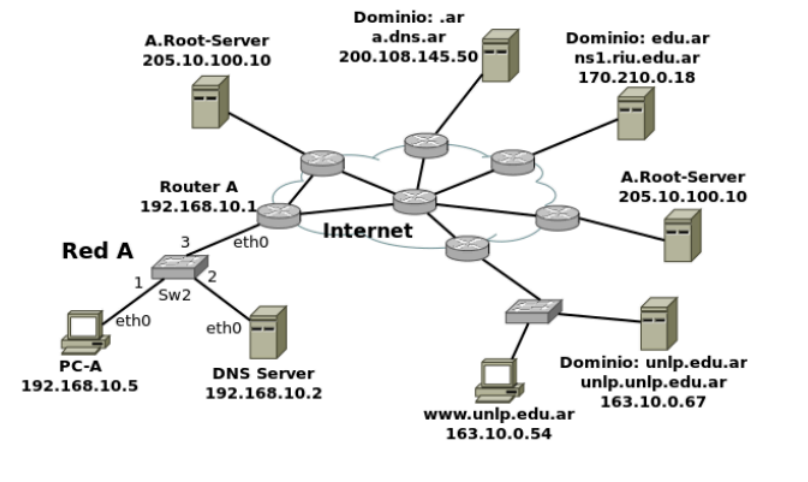

# tp3- Redes y Comunicaciones

---

Introducción

1. Investigue y describa cómo funciona el DNS. ¿Cuál es su objetivo?
2. ¿Qué es un root server? ¿Qué es un generic top-level domain (gtld)?
3. ¿Qué es una respuesta del tipo autoritativa?
4. ¿Qué diferencia una consulta DNS recursiva de una iterativa?
5. ¿Qué es el resolver?
6. Describa para qué se utilizan los siguientes tipos de registros de DNS:
a. A f. NS
b. MX g. CNAME
c. PTR h. SOA
d. AAAA i. TXT
e. SRV
7. En Internet, un dominio suele tener más de un servidor DNS, ¿por qué cree que esto es
así?
8. Cuando un dominio cuenta con más de un servidor, uno de ellos es el primario (o
maestro) y todos los demás son secundarios (o esclavos). ¿Cuál es la razón de que sea
así?
9. Explique brevemente en qué consiste el mecanismo de transferencia de zona y cuál es
su finalidad.
10. Imagine que usted es el administrador del dominio de DNS de la UNLP ([unlp.edu.ar](http://unlp.edu.ar/)). A
su vez, cada facultad de la UNLP cuenta con un administrador que gestiona su propio
dominio (por ejemplo, en el caso de la Facultad de Informática se trata de [info.unlp.edu.ar](http://info.unlp.edu.ar/)).
Suponga que se crea una nueva facultad, Facultad de Redes, cuyo dominio será
[redes.unlp.edu.ar](http://redes.unlp.edu.ar/), y el administrador le indica que quiere poder manejar su propio dominio.
¿Qué debe hacer usted para que el administrador de la Facultad de Redes pueda gestionar
el dominio de forma independiente? (Pista: investigue en qué consiste la delegación de
dominios). Indicar qué registros de DNS se deberían agregar.
11. Responda y justifique los siguientes ejercicios.
a. En la VM, utilice el comando dig para obtener la dirección IP del host
[www.redes.unlp.edu.ar](http://www.redes.unlp.edu.ar/) y responda:
i. ¿La solicitud fue recursiva? ¿Y la respuesta? ¿Cómo lo sabe?
ii. ¿Puede indicar si se trata de una respuesta autoritativa? ¿Qué
significa que lo sea?
iii. ¿Cuál es la dirección IP del resolver utilizado? ¿Cómo lo sabe?
b. ¿Cuáles son los servidores de correo del dominio [redes.unlp.edu.ar](http://redes.unlp.edu.ar/)? ¿Por
qué hay más de uno y qué significan los números que aparecen entre MX y
el nombre? Si se quiere enviar un correo destinado a [redes.unlp.edu.ar](http://redes.unlp.edu.ar/), ¿a
qué servidor se le entregará? ¿En qué situación se le entregará al otro?
c. ¿Cuáles son los servidores de DNS del dominio [redes.unlp.edu.ar](http://redes.unlp.edu.ar/)?
d. Repita la consulta anterior cuatro veces más. ¿Qué observa? ¿Puede
explicar a qué se debe?
e. Observe la información que obtuvo al consultar por los servidores de DNS del
dominio. En base a la salida, ¿es posible indicar cuál de ellos es el primario?
f. Consulte por el registro SOA del dominio y responda.
i. ¿Puede ahora determinar cuál es el servidor de DNS primario?
ii. ¿Cuál es el número de serie, qué convención sigue y en qué casos es
importante actualizarlo?
iii. ¿Qué valor tiene el segundo campo del registro? Investigue para qué
se usa y cómo se interpreta el valor.
iv. ¿Qué valor tiene el TTL de caché negativa y qué significa?

g. Indique qué valor tiene el registro TXT para el nombre [saludo.redes.unlp.edu.ar](http://saludo.redes.unlp.edu.ar/). Investigue para qué es usado este registro.
h. Utilizando dig, solicite la transferencia de zona de [redes.unlp.edu.ar](http://redes.unlp.edu.ar/), analice
la salida y responda.
i. ¿Qué significan los números que aparecen antes de la palabra IN?
¿Cuál es su finalidad?
ii. ¿Cuántos registros NS observa? Compare la respuesta con los
servidores de DNS del dominio [redes.unlp.edu.ar](http://redes.unlp.edu.ar/) que dio
anteriormente. ¿Puede explicar a qué se debe la diferencia y qué
significa?
i. Consulte por el registro A de [www.redes.unlp.edu.ar](http://www.redes.unlp.edu.ar/) y luego por el registro A
de [www.practica.redes.unlp.edu.ar](http://www.practica.redes.unlp.edu.ar/). Observe los TTL de ambos. Repita la
operación y compare el valor de los TTL de cada uno respecto de la
respuesta anterior. ¿Puede explicar qué está ocurriendo? (Pista: observar los
flags será de ayuda).
j. Consulte por el registro A de [www.practica2.redes.unlp.edu.ar](http://www.practica2.redes.unlp.edu.ar/). ¿Obtuvo
alguna respuesta? Investigue sobre los códigos de respuesta de DNS. ¿Para
qué son utilizados los mensajes NXDOMAIN y NOERROR?

1. Investigue los comandos nslookup y host. ¿Para qué sirven? Intente con ambos
comandos obtener:
● Dirección IP de [www.redes.unlp.edu.ar](http://www.redes.unlp.edu.ar/).
● Servidores de correo del dominio [redes.unlp.edu.ar](http://redes.unlp.edu.ar/).
● Servidores de DNS del dominio [redes.unlp.edu.ar](http://redes.unlp.edu.ar/).
2. ¿Qué función cumple en Linux/Unix el archivo /etc/hosts o en Windows el archivo
\WINDOWS\system32\drivers\etc\hosts?
3. Abra el programa Wireshark para comenzar a capturar el tráfico de red en la interfaz con
IP 172.28.0.1. Una vez abierto realice una consulta DNS con el comando dig para averiguar
el registro MX de [redes.unlp.edu.ar](http://redes.unlp.edu.ar/) y luego, otra para averiguar los registros NS
correspondientes al dominio [redes.unlp.edu.ar](http://redes.unlp.edu.ar/). Analice la información proporcionada por dig
y compárelo con la captura.
4. Dada la siguiente situación: “Una PC en una red determinada, con acceso a Internet,
utiliza los servicios de DNS de un servidor de la red”. Analice:
a. ¿Qué tipo de consultas (iterativas o recursivas) realiza la PC a su servidor de
DNS?
b. ¿Qué tipo de consultas (iterativas o recursivas) realiza el servidor de DNS
para resolver requerimientos de usuario como el anterior? ¿A quién le realiza
estas consultas?
5. Relacione DNS con HTTP. ¿Se puede navegar si no hay servicio de DNS?
6. Observar el siguiente gráfico y contestar:



          a. Si la PC-A, que usa como servidor de DNS a "DNS Server", desea obtener la
             IP de [www.unlp.edu.ar](http://www.unlp.edu.ar/), cuáles serían, y en qué orden, los pasos que se
             ejecutarán para obtener la respuesta.
           b. ¿Dónde es recursiva la consulta? ¿Y dónde iterativa?
18. ¿A quién debería consultar para que la respuesta sobre [www.google.com](http://www.google.com/) sea
autoritativa?
19. ¿Qué sucede si al servidor elegido en el paso anterior se lo consulta por
[www.info.unlp.edu.ar](http://www.info.unlp.edu.ar/)? ¿Y si la consulta es al servidor 8.8.8.8?

---

Ejercicio de parcial


a. Complete las líneas donde aparece __ con el registro correcto.

b. ¿Es una respuesta autoritativa? En caso de no serlo, ¿a qué servidor le preguntaría
para obtener una respuesta autoritativa?
c. ¿La consulta fue recursiva? ¿Y la respuesta?
d. ¿Qué representan los valores 10 y 5 en las líneas (1) y (2).

---

## Rtas

**1 Investigue y describa cómo funciona el DNS. ¿Cuál es su objetivo?**

### ¿Qué es el DNS y cuál es su objetivo?

El **DNS** (Domain Name System o Sistema de Nombres de Dominio) es como la *guía telefónica de Internet*. Su principal objetivo es **traducir los nombres de dominio que usamos los humanos (como `www.google.com`) en direcciones IP** (como `142.250.78.68`), que son las que realmente entienden las computadoras para comunicarse entre sí.

---

### ¿Cómo funciona el DNS?

1. **Escribís una dirección web** en el navegador, por ejemplo, `www.example.com`.
2. **Tu dispositivo consulta a un "resolver DNS"** (normalmente provisto por tu proveedor de internet o uno público como el de Google: `8.8.8.8`).
3. **El resolver busca en caché** si ya tiene guardada la IP de ese dominio. Si la tiene, te la devuelve al toque.
4. Si no está en caché, empieza una serie de consultas:
    - Primero le pregunta a un **servidor raíz DNS** (root server), que le dice cuál es el servidor de nombres para el dominio de nivel superior (por ejemplo, `.com`).
    - Luego consulta ese servidor `.com`, que le indica quién tiene la info específica de `example.com`.
    - Finalmente, el resolver consulta al **servidor autoritativo** de `example.com`, que le da la IP exacta.
5. **El resolver te devuelve la IP** y tu computadora ya sabe a dónde conectarse.
6. **Todo este proceso es rapidísimo**, y muchas veces se acelera con caché local o del proveedor.

---

### ¿Por qué es importante?

- Sin DNS, tendrías que memorizar direcciones IP para entrar a cualquier sitio. Una locura.
- Hace que Internet sea más amigable para nosotros.
- También permite otras cosas como el uso de subdominios, balanceo de carga, y seguridad (por ejemplo, con DNSSEC o filtrado de sitios).

---

**Las busquedas de dns a servidores van de derecha a izquierda?
ejemplo
si tengo [www.hola.unlp.edu.ar](http://www.hola.unlp.edu.ar/)**

**primero se busca .ar**

**despues desde .ar busca .edu?
o .ar le dice donde [buscar.edu](http://buscar.edu/) y se lo delega a .edu**

 Sí, la idea general **es que las búsquedas de DNS se hacen "de derecha a izquierda"**, como vos planteás.

Vamos a desmenuzarlo con tu ejemplo: `www.hola.unlp.edu.ar`

---

### ¿Cómo se resuelve `www.hola.unlp.edu.ar` en el DNS?

1. **Tu computadora pregunta al resolver DNS** por la IP de `www.hola.unlp.edu.ar`.
2. El resolver **empieza preguntándole al servidor raíz (root)**:
    
    👉 "Che, ¿quién sabe sobre `.ar`?"
    
3. El **root responde**:
    
    👉 "Acá tenés los servidores que manejan `.ar`."
    
4. El resolver le pregunta al servidor de `.ar`:
    
    👉 "¿Quién tiene información sobre `edu.ar`?"
    
5. El servidor de `.ar` responde:
    
    👉 "Estos son los servidores autoritativos para `edu.ar`."
    
6. El resolver consulta a `edu.ar`:
    
    👉 "¿Y vos sabés algo sobre `unlp.edu.ar`?"
    
7. El servidor de `edu.ar` responde:
    
    👉 "Sí, pero lo maneja este otro servidor, el de `unlp.edu.ar`."
    
8. El resolver le pregunta al servidor de `unlp.edu.ar`:
    
    👉 "¿Tenés la IP de `www.hola.unlp.edu.ar`?"
    
9. Finalmente, ese servidor responde con la dirección IP, si la tiene configurada.

---

### O sea, la búsqueda es así:

```
.root → .ar → edu.ar → unlp.edu.ar → hola.unlp.edu.ar → www.hola.unlp.edu.ar

```

(En realidad, los niveles `www` y `hola` pueden estar definidos juntos o separados en el servidor final.)

---

### En resumen:

- **Sí**, el proceso va de **derecha a izquierda**, desde el **TLD** (Top-Level Domain, como `.ar`) hacia los subdominios.
- Cada nivel **delegado** va indicando cuál es el servidor que maneja el siguiente nivel.
- Es un sistema **jerárquico y distribuido**, lo que lo hace escalable y muy eficiente.

---

Si querés te puedo mostrar un ejemplo real usando el comando `dig`, así ves cómo se va resolviendo cada parte. ¿Te gustaría?

Ejemplo paso a paso usando `dig` para ver cómo se resuelve un dominio como `www.unlp.edu.ar`.

Podés hacer esto desde una terminal (en Linux o WSL, por ejemplo). Vamos primero con una consulta normal:

---

### 1. Consulta completa del dominio

```bash
dig www.unlp.edu.ar

```

Esto te da una resolución completa, pero con caché y todo resuelto rápido por tu resolver local o el DNS de tu proveedor.

---

### 2. Usando `+trace` para ver la resolución paso a paso

```bash
dig +trace www.unlp.edu.ar

```

Este es el más interesante. Hace que `dig` actúe como un **resolver DNS completo**, siguiendo la cadena desde los root servers. Vas a ver una salida como esta (recortada para que no sea un choclo enorme):

```
; <<>> DiG 9.18.1 <<>> +trace www.unlp.edu.ar
;; global options: +cmd
.                       518400  IN      NS      a.root-servers.net.
... (otros root servers)
;; Received 508 bytes from 127.0.0.53#53(127.0.0.53) in 1 ms

ar.                     172800  IN      NS      a.dns.ar.
... (otros NS de .ar)
;; Received 598 bytes from 198.41.0.4#53(a.root-servers.net) in 148 ms

edu.ar.                 86400   IN      NS      ns1.unlp.edu.ar.
... (otros NS de edu.ar)
;; Received 257 bytes from 200.16.86.1#53(a.dns.ar) in 43 ms

unlp.edu.ar.            86400   IN      NS      ns1.unlp.edu.ar.
... (otros NS)
;; Received 257 bytes from 163.10.20.21#53(ns1.unlp.edu.ar) in 24 ms

www.unlp.edu.ar.        86400   IN      A       163.10.20.21

```

---

### ¿Qué estamos viendo?

1. **Empieza en el root (`.`)**: le da la dirección de los servidores `.ar`.
2. **Consulta `.ar`**: le dice dónde buscar `edu.ar`.
3. **Consulta `edu.ar`**: encuentra los servidores de `unlp.edu.ar`.
4. **Consulta `unlp.edu.ar`**: finalmente da la IP de `www.unlp.edu.ar`.

---

### Bonus: si querés ver quién es el Name Server de un dominio específico:

```bash
dig edu.ar NS

```

---

Todo eso te muestra *en vivo* cómo el DNS hace la búsqueda de derecha a izquierda.

📌 El registro `NS` es como el cartel que dice *"preguntale a esta persona por más información sobre este lugar"*.

1. **¿Qué es un root server? ¿Qué es un generic top-level domain (gtld)?**

---

### 📌 ¿Qué es un **Root Server**?

Un **Root Server** (servidor raíz) es el **punto de partida del sistema DNS**. Son servidores que **responden consultas sobre los dominios de nivel superior (TLDs)**, como `.com`, `.ar`, `.org`, `.net`, etc.

### Algunas claves:

- Son 13 servidores principales, identificados con letras: **A** hasta **M**.
- Pero no te asustes, no hay solo 13 máquinas. Cada uno tiene **muchas copias distribuidas por el mundo** (usando *anycast*) para velocidad y tolerancia a fallos.
- Su función no es resolver direcciones completas como `www.unlp.edu.ar`, sino **decirle al resolver "andá a preguntarle al TLD correspondiente"**.

📌 Ejemplo:

Si consultás un dominio como `www.google.com`, el root server te va a decir:

*"Para `.com`, estos son los servidores que saben más. Preguntales a ellos."*

---

### 📌 ¿Qué es un **gTLD** (Generic Top-Level Domain)?

Un **gTLD (generic Top-Level Domain)** es un tipo de **dominio de nivel superior** que **no está asociado a un país**, sino que es **genérico o temático**.

### Ejemplos comunes de gTLDs:

- `.com` → comercial (el más popular)
- `.org` → organizaciones sin fines de lucro
- `.net` → redes
- `.info` → información
- `.biz` → negocios

Y hoy en día hay montones más, incluso modernos como:

- `.tech`, `.dev`, `.app`, `.shop`, `.club`, `.xyz`, etc.

### ¿Quién los administra?

👉 La mayoría están bajo la autoridad de **ICANN**, que se encarga de la coordinación global del DNS.

---

### 🆚 ¿Y los **ccTLD**?

Son los **country code Top-Level Domains**, o sea, **TLDs específicos de países**.

Ejemplos:

- `.ar` → Argentina 🇦🇷
- `.br` → Brasil 🇧🇷
- `.fr` → Francia 🇫🇷
- `.uk`, `.es`, `.us`, etc.

---

### En resumen:

| Concepto | Qué es |
| --- | --- |
| **Root Server** | Servidor DNS raíz, primer paso para resolver cualquier dominio |
| **gTLD** | Dominio genérico de nivel superior (como `.com`, `.org`) |
| **ccTLD** | Dominio de país de nivel superior (como `.ar`, `.br`) |

---

1. **¿Qué es una respuesta del tipo autoritativa?**

---

### 📌 ¿Qué es una respuesta **autoritativa**?

Una **respuesta autoritativa** es cuando un servidor DNS **responde con información que él mismo administra directamente**. O sea, **tiene autoridad sobre ese dominio** y te está dando una respuesta oficial, no una copiada de otro o sacada de caché.

---

### 🔍 Ejemplo concreto:

Si consultás el dominio `unlp.edu.ar` y el servidor que responde es el **servidor oficial de la UNLP**, entonces te da una **respuesta autoritativa**.

En cambio, si le preguntás a tu proveedor de internet, o a Google DNS (`8.8.8.8`), es probable que te dé una **respuesta no autoritativa**, basada en caché.

---

### 🧠 ¿Cómo saber si una respuesta es autoritativa?

Cuando usás `dig`, te lo dice en la salida.

### Ejemplo:

```bash
dig @ns1.unlp.edu.ar www.unlp.edu.ar

```

La salida incluye esto:

```
;; flags: qr aa rd; QUERY: 1, ANSWER: 1, ...

```

La clave está en el flag **`aa`** (Authoritative Answer):

- Si aparece `aa`, es **autoritativa** ✅
- Si no aparece `aa`, no es autoritativa ❌

---

### 🎯 ¿Por qué importa?

Porque:

- Las **respuestas autoritativas son las más confiables**.
- Los **servidores autoritativos son los únicos que realmente "saben"** los registros correctos del dominio.
- Otros servidores solo pueden **guardar copias temporales** (caché), pero no tienen autoridad real.

---

### Resumen corto:

> Una respuesta autoritativa en DNS viene desde el servidor oficial del dominio consultado.
> 
> 
> Es como si le preguntaras algo a alguien que **realmente lo gestiona**, no a un intermediario.
> 

---

En que casos se utilizaria la respuesta autoritativa?

ejemplo si hago una busqeuda
[hola.unlp.edu.ar](http://hola.unlp.edu.ar/)

en cada nivel .ar .edu .unlp  seria una respuesta autoritativa? ya que el que va responder va ser el servidor a cardo de cada dominio??

---

### 📌 ¿Cuándo se utiliza una **respuesta autoritativa**?

Una **respuesta autoritativa se usa siempre que el servidor que responde es responsable directo del dominio** que se está consultando.

### ✅ Entonces, **sí**, en cada nivel donde hay una delegación oficial, si el servidor que responde **es el que tiene autoridad sobre ese dominio**, **la respuesta es autoritativa**.

---

### Pongamos tu ejemplo: `hola.unlp.edu.ar`

### Paso a paso (simplificado):

1. **Consulta al root server (`.`)** →
    
    *"¿Quién maneja `.ar`?"*
    
    ✅ El root da **una respuesta autoritativa para `.ar`**.
    
2. **Consulta a `.ar`** →
    
    *"¿Quién maneja `edu.ar`?"*
    
    ✅ El servidor de `.ar` responde con **autoridad sobre `.ar`**.
    
3. **Consulta a `edu.ar`** →
    
    *"¿Quién maneja `unlp.edu.ar`?"*
    
    ✅ El servidor de `edu.ar` responde **con autoridad sobre `edu.ar`**.
    
4. **Consulta a `unlp.edu.ar`** →
    
    *"¿Cuál es la IP de `hola.unlp.edu.ar`?"*
    
    ✅ El servidor de `unlp.edu.ar` responde **con autoridad sobre ese subdominio**, si está definido ahí.
    

---

### 🧠 Importante:

Cada servidor **no responde por toda la cadena completa**, solo por **la parte que administra**. Y **la respuesta autoritativa aplica solo a esa parte**.

---

### 🔁 ¿Cuándo no es autoritativa?

Cuando hacés una búsqueda a un **servidor recursivo** (como `8.8.8.8` o el de tu ISP), es muy probable que:

- Te devuelva una respuesta que **sacó de su caché**
- O incluso, resolvió todo él solo preguntando a otros servidores
- Pero **no es autoritativo**, porque **no administra ese dominio**

---

### ⚠️ Casos de uso:

- Las **respuestas autoritativas se usan para garantizar la exactitud de los datos**, como cuando:
    - Se está propagando un nuevo dominio o subdominio
    - Se detecta un conflicto o discrepancia
    - Se hace diagnóstico técnico con `dig`, `nslookup`, etc.
    - Se hace una **delegación** de subdominios (como `sistemas.unlp.edu.ar`, por ejemplo)

---

### En resumen:

**En cada nivel que responde un servidor con autoridad sobre esa parte del nombre de dominio, la respuesta es autoritativa**.

El resolver DNS (como el de tu compu) **va recolectando esas respuestas autoritativas paso a paso**, hasta que llega al servidor final que sabe la IP exacta.

1. ¿Qué diferencia una consulta DNS recursiva de una iterativa?

---

### 📌 ¿Qué es una **consulta recursiva**?

Una **consulta recursiva** es cuando **le pedís a un servidor DNS que te resuelva TODO el dominio completo**, sin que vos tengas que hacer nada más.

> 🗣️ Vos le decís: "Decime la IP de hola.unlp.edu.ar, no me importa cómo, pero traeme el resultado final."
> 

Ese servidor (normalmente el de tu proveedor o Google DNS `8.8.8.8`) va a:

1. Preguntar al root server quién sabe sobre `.ar`
2. Preguntar a `.ar` quién sabe sobre `edu.ar`
3. Preguntar a `edu.ar` quién sabe sobre `unlp.edu.ar`
4. Preguntar a `unlp.edu.ar` por `hola.unlp.edu.ar`
5. Y cuando tiene la IP, te responde

📦 Vos recibís solo **una respuesta**, ya con la **IP final**.

---

### 🔁 ¿Qué es una **consulta iterativa**?

Una **consulta iterativa** es cuando **el servidor DNS al que le preguntás no resuelve todo**, sino que **te va diciendo a quién deberías preguntarle después**.

> 🗣️ Vos le decís: "¿Sabés la IP de hola.unlp.edu.ar?"
> 
> 
> El servidor responde: *"No, pero andá a preguntarle a este otro."*
> 

Y entonces **tu cliente DNS (en tu compu)** va siguiendo esa cadena paso a paso, consultando cada servidor que le indican.

---

### ⚖️ Comparación clara:

| Concepto | Recursiva 🧭 | Iterativa 🔗 |
| --- | --- | --- |
| ¿Quién resuelve todo? | El servidor DNS remoto | Vos (tu cliente DNS) hace las consultas una a una |
| ¿Quién hace el trabajo duro? | El resolver (como 8.8.8.8 o el de tu ISP) | Tu máquina (o un resolver personalizado) |
| ¿Cuántas respuestas ves? | Una sola, con el resultado final | Varias, cada una con información parcial |
| ¿Es común en...? | Usuarios finales | Servidores recursivos (resolvers) y debugging |

---

### 🧪 Ejemplo práctico:

### Consulta recursiva (lo que hacés normalmente):

```bash
dig hola.unlp.edu.ar

```

Te da la IP directo (si existe), sin mostrar todo el camino.

### Consulta iterativa (usando `+trace`, simula ese comportamiento):

```bash
dig +trace hola.unlp.edu.ar

```

Ahí ves paso a paso cómo va preguntando desde el root hasta llegar al servidor autoritativo final.

---

### 🧠 ¿Por qué existen las dos?

- Las **recursivas** simplifican la vida del usuario.
- Las **iterativas** permiten distribuir la carga del sistema y hacerlo más escalable.
- Generalmente, **tu compu hace una consulta recursiva** a un **servidor recursivo**, que a su vez hace consultas **iterativas** a los demás servidores DNS hasta armar la respuesta final.

---


1. **¿Qué es el resolver?**

---

### 📌 ¿Qué es un **resolver**?

Un **resolver DNS** (también llamado *recursor*) es el componente que se encarga de **resolver nombres de dominio** a direcciones IP por vos. Es como **el encargado de hacer las preguntas necesarias en la red para darte la respuesta final**.

> Vos le pedís: "¿Cuál es la IP de www.unlp.edu.ar?"
> 
> 
> Y él sale a buscarla, paso a paso, hasta traerte la respuesta.
> 

---

### 🧠 ¿Dónde vive el resolver?

Puede estar en varios lugares:

- ✅ En el servidor DNS de tu **proveedor de internet**
- ✅ En servidores públicos como **Google DNS (8.8.8.8)**, **Cloudflare (1.1.1.1)** o **Quad9 (9.9.9.9)**
- ✅ En algunas redes grandes (como universidades o empresas) tienen su **propio servidor resolver**

Tu computadora o teléfono generalmente **no resuelve por sí mismo** todos los pasos. En vez de eso, le pregunta al **resolver**, que es el que se encarga de todo.

---

### 🔁 ¿Qué hace un resolver, paso a paso?

1. Recibe tu consulta: *"¿Cuál es la IP de `hola.unlp.edu.ar`?"*
2. Si la tiene en caché, te responde directo.
3. Si no la tiene:
    - Consulta al root server (`.`)
    - Consulta al TLD (`.ar`)
    - Consulta a `edu.ar`
    - Consulta a `unlp.edu.ar`
    - Llega a `hola.unlp.edu.ar`
4. Te responde con la IP.
5. Guarda la respuesta en **caché** por un tiempo (definido por el TTL del registro).

---

### 🎯 En resumen:

> El resolver DNS es como tu "asistente personal de internet":
> 
> 
> Le pedís un nombre y él se encarga de encontrar su IP, hablando con todos los servidores necesarios, **de forma recursiva o iterativa según el caso**.
> 

---

Esquema del flujo de resolución DNS entre el **cliente**, el **resolver** (recursor) y los **servidores DNS**:

```
[ Cliente ]
     |
     v
[ Resolver DNS (Proveedor / Sistema Operativo) ]
     |
     |--- Consulta a Cache
     |         |
     |         v
     |    ¿Respuesta en cache?
     |         |----> Sí --> Devuelve respuesta al cliente
     |         |
     |         v
     |        No
     |
     v
[ Servidores raíz (.) ]
     |
     v
[ Servidores TLD (por ej., .com, .net) ]
     |
     v
[ Servidor autoritativo (por ej., para google.com) ]
     |
     v
[ Resolver DNS ]
     |
     v
[ Cliente ]

```

**Explicación rápida**:

1. El **cliente** (navegador, app) pide una dirección (por ej., `google.com`) al **resolver**.
2. El **resolver** primero revisa su **cache**.
3. Si no la tiene, consulta a los **servidores raíz**.
4. Los **raíz** redirigen al **TLD** correspondiente (por ej., `.com`).
5. El **TLD** redirige al **servidor autoritativo** del dominio.
6. El **resolver** obtiene la IP y la guarda en caché.
7. Devuelve la IP al **cliente**, que ya puede conectarse.

1. Describa para qué se utilizan los siguientes tipos de registros de DNS:
a. A f. NS
b. MX g. CNAME
c. PTR h. SOA
d. AAAA i. TXT
e. SRV

---

**a. A (Address)**

→ Asocia un nombre de dominio con una dirección IPv4.

El registro A (Address Record) es uno de los más comunes y asocia un
nombre de dominio con una dirección IPv4. Cada vez que un usuario ingresa
un dominio en su navegador, el servidor DNS busca el registro A para obtener
la dirección IP del servidor donde está alojado el sitio web.

**Ejemplo:** `ejemplo.com -> 192.0.2.1`

---

**b. MX (Mail Exchange)**

→ Indica qué servidor se encarga de recibir el correo electrónico de un dominio.

El registro MX (Mail Exchange Record) indica los servidores de correo
responsables de recibir correos electrónicos para el dominio. Define la
prioridad y el servidor al cual deben ser enviados los correos electrónicos
destinados a ese dominio.

**Ejemplo:** `correo.ejemplo.com` con prioridad `10`

---

**c. PTR (Pointer)**

→ Se usa para la resolución inversa: convierte una IP en un nombre de dominio.

El registro PTR (Pointer Record) es utilizado en las búsquedas DNS inversas,
es decir, cuando se desea encontrar el nombre de dominio asociado a una
dirección IP. Es común en sistemas de autenticación y correo para verificar el
origen de los mensajes.

**Ejemplo:** `192.0.2.1 -> ejemplo.com`

---

**d. AAAA**

→ Igual que el registro A, pero para direcciones IPv6.

El registro AAAA (IPv6 Address Record) es similar al registro A, pero para
direcciones IPv6. Este registro asocia un nombre de dominio con una
dirección IP versión 6 (IPv6), que es la nueva generación de direcciones IP.

**Ejemplo:** `ejemplo.com -> 2001:db8::1`

---

**e. SRV (Service)**

→ Especifica información sobre servicios disponibles (como puertos y protocolos).

El registro SRV (Service Record) es utilizado para definir la ubicación de
servicios específicos dentro del dominio, como servidores de mensajería o
VoIP. Indica el puerto y la prioridad para acceder al servicio.

**Ejemplo:** `_sip._tcp.ejemplo.com -> servidor:5060`

---

**f. NS (Name Server)**

El registro NS (Name Server Record) indica los servidores DNS autoritativos
para un dominio. Estos son los servidores que tienen la autoridad para
responder consultas sobre el dominio en cuestión. A partir de esto, se puede
lograr una delegación de sub-dominios. No hay prioridad, todos los servidores
tienen la misma precedencia

→ Define qué servidores son autoritativos para un dominio.

**Ejemplo:** `ejemplo.com -> ns1.dnsprovider.com`

---

**g. CNAME (Canonical Name)**

El registro CNAME (Canonical Name Record) es utilizado para crear un alias
de un dominio. Redirige un nombre de dominio a otro, lo que permite usar

diferentes nombres de dominio que apunten a la misma dirección IP. Hacen el
mapeo del alias de un dominio su nombre canónico

→ Alias de otro nombre de dominio.

**Ejemplo:** `www.ejemplo.com -> ejemplo.com`

---

**h. SOA (Start of Authority)**

→ Contiene información principal del dominio: el servidor primario, contacto del admin, y datos de sincronización entre servidores.

El registro SOA (Start Of Authority Record) contiene información
administrativa sobre la zona DNS, como el servidor principal de la zona, el
correo electrónico del administrador, el número de serie y los tiempos de
actualización de los registros. Solo se admite un registro SOA por zona.
Permite que servidores autoritarios de la misma zona se puedan sincronizar.

**Ejemplo:** quién es el servidor principal del dominio y con qué frecuencia se actualiza.

---

**i. TXT (Text)**

→ Guarda texto arbitrario, comúnmente usado para verificación de dominio y políticas SPF/DKIM/DMARC.

El registro TXT (Text Record) permite asociar texto arbitrario a un dominio.
Se utiliza para diversas finalidades, como verificar la propiedad del dominio o
especificar políticas de seguridad (por ejemplo, en SPF o DKIM para proteger
el correo electrónico).

**Ejemplo:** `v=spf1 include:_spf.google.com ~all`

---

**Tabla resumen** de los principales tipos de registros DNS:

| **Registro** | **Nombre** | **Función principal** |
| --- | --- | --- |
| **A** | Address | Asocia un dominio a una dirección IPv4. |
| **AAAA** | IPv6 Address | Asocia un dominio a una dirección IPv6. |
| **MX** | Mail Exchange | Define los servidores de correo para el dominio. |
| **NS** | Name Server | Indica los servidores autoritativos del dominio. |
| **CNAME** | Canonical Name | Crea un alias hacia otro nombre de dominio. |
| **PTR** | Pointer (Reverse DNS) | Convierte una IP en un nombre de dominio (resolución inversa). |
| **SOA** | Start of Authority | Proporciona información principal del dominio (zona DNS, administración y control). |
| **SRV** | Service | Especifica información sobre servicios como puertos y protocolos. |
| **TXT** | Text | Contiene datos de texto libre, como verificación de dominios y políticas de seguridad. |

---

1. En Internet, un dominio suele tener más de un servidor DNS, ¿por qué cree que esto es
así?

---

### ¿Por qué un dominio suele tener **más de un servidor DNS**?

1. **Redundancia / Tolerancia a fallos**
    
    Si un servidor DNS deja de funcionar (por una caída, ataque o error), los otros pueden seguir respondiendo. Esto **evita interrupciones** en el acceso al dominio.
    
2. **Alta disponibilidad (24/7)**
    
    Tener múltiples servidores garantiza que siempre haya uno disponible para responder, lo que es **clave para servicios críticos** (web, mail, apps).
    
3. **Distribución geográfica**
    
    Algunos servidores DNS están ubicados en distintas partes del mundo. Esto **mejora la velocidad** de respuesta al usuario más cercano y **reduce la carga** sobre un solo servidor.
    
4. **Balanceo de carga**
    
    Se puede repartir el tráfico entre varios servidores para **evitar saturaciones** y garantizar respuestas rápidas.
    
5. **Requerimiento técnico**
    
    Los estándares de Internet (como los de ICANN e IANA) **recomiendan o exigen** que un dominio tenga **mínimo dos servidores NS**, preferiblemente en distintas redes.
    

---

En resumen: **más servidores = más confiabilidad, velocidad y seguridad.**

1. Cuando un dominio cuenta con más de un servidor, uno de ellos es el primario (o
maestro) y todos los demás son secundarios (o esclavos). ¿Cuál es la razón de que
sea así?

 El modelo **primario/secundario** en servidores DNS existe por una cuestión de **organización, consistencia y eficiencia en la administración de los datos** del dominio.

---

### ¿Por qué se usa un servidor **primario (maestro)** y varios **secundarios (esclavos)**?

1. **Centralización del control (zona DNS)**
    
    El servidor **primario** es el único que se puede **editar directamente**. Allí es donde el administrador del dominio crea, modifica o elimina los registros DNS.
    
    → Esto **evita conflictos** y garantiza que los cambios se hagan desde un único punto de control.
    
2. **Replicación automática (zonas)**
    
    Los servidores **secundarios** no se editan a mano. Ellos **copian automáticamente** la información del primario mediante un proceso llamado **transferencia de zona (zone transfer)**.
    
    → Así se asegura que todos tengan una **copia exacta y sincronizada** de los registros.
    
3. **Mayor disponibilidad**
    
    Si el primario se cae o queda inaccesible, los secundarios pueden seguir respondiendo consultas DNS, ya que tienen una copia de la zona.
    
    → Esto mejora la **tolerancia a fallos**.
    
4. **Menor carga en el primario**
    
    Las consultas DNS pueden ser distribuidas entre el primario y los secundarios, lo que **reduce la carga** sobre el servidor maestro.
    

---

### En resumen:

- **Primario**: origen oficial de los datos, editable.
- **Secundarios**: copias sincronizadas, solo lectura.
- **Ventaja**: mejor gestión, alta disponibilidad y menos errores.

---

---

### 🔹 Si el **servidor primario está caído**, ¿responden los **esclavos**?

✅ **Sí**, los servidores secundarios (**esclavos**) **pueden responder normalmente** a las consultas DNS **mientras tengan una copia válida de la zona** (es decir, que no haya vencido el tiempo `Expire` del SOA).

> 📌 Incluso si el primario está offline, los esclavos siguen funcionando mientras la información no esté "caduca".
> 

---

### 🔹 Cuando un cliente pregunta por `hola.olu`, ¿quién responde?

1. El **resolver del cliente** pregunta:
    
    *"¿Quién es autoritativo para `.olu`?"*
    
2. Los **servidores raíz** responden:
    
    *"Los servidores de zona TLD para `.olu` son estos:..."*
    
3. Luego el resolver pregunta a uno de esos servidores `.olu`:
    
    *"¿Quién tiene autoridad sobre `hola.olu`?"*
    
4. Y ahí, el **registro NS** del dominio `hola.olu` va a devolver la lista de **servidores autoritativos** (tanto primario como secundarios).

---

### 🔸 Por ejemplo:

Registro NS de `hola.olu`:

```
hola.olu. IN NS ns1.hola.olu.  (primario)
hola.olu. IN NS ns2.hola.olu.  (secundario)
hola.olu. IN NS ns3.hola.olu.  (secundario)

```

Entonces el cliente o resolver elegirá **uno de esos** (a veces aleatoriamente o según tiempo de respuesta), y **consultará directamente** a ese servidor.

👉 Si el primario (**ns1**) está caído, pero **ns2 o ns3** funcionan, **ellos responden la consulta igual** sin problema.

---

### 🧠 En resumen:

- Los **servidores secundarios** son igual de válidos que el primario para **responder consultas**.
- La única diferencia es que **el primario se edita** y los secundarios **copian** de él.
- Todos aparecen en los **registros NS del dominio**, por lo que el resolver puede hablar con cualquiera.

---

1. Explique brevemente en qué consiste el mecanismo de transferencia de zona y cuál es
su finalidad.

---

### 🔄 ¿Qué es la **transferencia de zona**?

Es el proceso mediante el cual un **servidor DNS secundario (esclavo)** obtiene una **copia actualizada de la zona DNS** desde el **servidor primario (maestro)**.

---

### 🎯 ¿Cuál es su finalidad?

- **Mantener sincronizados** todos los servidores autoritativos del dominio.
- Asegurar que los **secundarios tengan una copia exacta y actualizada** de los registros DNS.
- **Distribuir la carga** de trabajo entre varios servidores.
- Aumentar la **disponibilidad y tolerancia a fallos** del servicio DNS.

---

### 📦 Tipos de transferencia:

| Tipo | Descripción |
| --- | --- |
| **AXFR** | Transferencia completa de la zona (todos los registros). |
| **IXFR** | Transferencia incremental: solo copia los cambios desde la última actualización. |

---

### 🔐 Nota de seguridad:

Las transferencias de zona deben configurarse de forma **segura y controlada**, ya que podrían **exponer información sensible** del dominio si están abiertas a cualquier servidor.

---

1.  Imagine que usted es el administrador del dominio de DNS de la UNLP ([unlp.edu.ar](http://unlp.edu.ar/)). A
su vez, cada facultad de la UNLP cuenta con un administrador que gestiona su propio
dominio (por ejemplo, en el caso de la Facultad de Informática se trata de [info.unlp.edu.ar](http://info.unlp.edu.ar/)).
Suponga que se crea una nueva facultad, Facultad de Redes, cuyo dominio será
[redes.unlp.edu.ar](http://redes.unlp.edu.ar/), y el administrador le indica que quiere poder manejar su propio dominio.
¿Qué debe hacer usted para que el administrador de la Facultad de Redes pueda gestionar
el dominio de forma independiente? (Pista: investigue en qué consiste la delegación de
dominios). Indicar qué registros de DNS se deberían agregar.

Acá se trata de aplicar el **concepto de delegación de dominios**, muy usado en grandes organizaciones como universidades.

---

### 🔧 ¿Qué es la **delegación de dominio**?

Es el proceso mediante el cual el administrador de un dominio **(en este caso `unlp.edu.ar`)** le transfiere **autoridad sobre un subdominio** (como `redes.unlp.edu.ar`) a otro servidor DNS que será administrado por otra persona o entidad (el admin de la Facultad de Redes).

---

### 📌 ¿Qué implica la delegación?

Significa que **vos, como admin de `unlp.edu.ar`**, le decís al sistema DNS:

> “Para todo lo relacionado con redes.unlp.edu.ar, preguntale a estos servidores DNS que administra la Facultad de Redes”.
> 

---

### 🧩 ¿Qué tenés que hacer como administrador de `unlp.edu.ar`?

Debés agregar al archivo de zona de `unlp.edu.ar` **registros `NS` (Name Server)** que deleguen el subdominio `redes.unlp.edu.ar` hacia los servidores DNS de la nueva facultad.

También es común (aunque opcional) agregar registros `A` o `AAAA` para resolver el nombre de esos servidores si están dentro del mismo dominio (glue records).

---

### 📝 Ejemplo de los registros que deberías agregar:

```
; Delegación del subdominio redes.unlp.edu.ar
redes.unlp.edu.ar. IN NS ns1.redes.unlp.edu.ar.
redes.unlp.edu.ar. IN NS ns2.redes.unlp.edu.ar.

; Glue records (si los NS están dentro del mismo subdominio)
ns1.redes.unlp.edu.ar. IN A 192.0.2.10
ns2.redes.unlp.edu.ar. IN A 192.0.2.11

```

---

### ✅ Resultado:

A partir de ahí:

- El DNS de `unlp.edu.ar` **deja de ser autoritativo** para `redes.unlp.edu.ar`.
- Todo lo que se consulte sobre `redes.unlp.edu.ar` se dirige automáticamente a los servidores definidos por `ns1` y `ns2`.
- El administrador de la Facultad de Redes puede mantener sus propios registros (`A`, `MX`, `TXT`, etc.) de forma **independiente**.

---

1. **Responda y justifique los siguientes ejercicios.
a. En la VM, utilice el comando dig para obtener la dirección IP del host
[www.redes.unlp.edu.ar](http://www.redes.unlp.edu.ar/) y responda:
i. ¿La solicitud fue recursiva? ¿Y la respuesta? ¿Cómo lo sabe?
ii. ¿Puede indicar si se trata de una respuesta autoritativa? ¿Qué
significa que lo sea?**
    
    **iii. ¿Cuál es la dirección IP del resolver utilizado? ¿Cómo lo sabe?**
    


---

### 🔎 Comando ejecutado:

```bash
dig www.redes.unlp.edu.ar

```

---

### 📌 Respuestas a las preguntas:

---

### **i. ¿La solicitud fue recursiva? ¿Y la respuesta? ¿Cómo lo sabe?**

- **Solicitud recursiva**: ✅ **Sí lo fue**.
    - Lo indica la **flag `rd`** (Recursion Desired) en la parte del encabezado:
        
        ```
        flags: qr aa rd ra;
        
        ```
        
- **Respuesta recursiva**: ✅ **Sí**.
    - Lo indica la **flag `ra`** (Recursion Available), que significa que el servidor **admite y realizó** la recursión.

---

### **ii. ¿Es una respuesta autoritativa? ¿Qué significa que lo sea?**

- ✅ **Sí, es autoritativa.**
    - Lo indica la **flag `aa`** (Authoritative Answer).

📘 **¿Qué significa?**

> Significa que el servidor que respondió es autoritativo para el dominio www.redes.unlp.edu.ar, es decir, tiene los datos originales (o una copia válida si es secundario) de esa zona DNS. No está reenviando una respuesta de otro, ni usando caché.
> 

---

### **iii. ¿Cuál es la dirección IP del resolver utilizado? ¿Cómo lo sabe?**

- La IP del resolver es: `172.28.0.29`

🧠 ¿Cómo lo sabemos?

> Está especificada justo antes de la hora en la parte inferior del output:
> 

```
;; SERVER: 172.28.0.29#53(172.28.0.29)

```

Es la dirección IP del servidor DNS al que se le consultó (probablemente configurado en `/etc/resolv.conf` de la VM).

---

### ✅ Resumen:

| Pregunta | Respuesta |
| --- | --- |
| Solicitud recursiva | ✅ Sí (`rd`) |
| Respuesta recursiva | ✅ Sí (`ra`) |
| Autoritativa | ✅ Sí (`aa`) |
| IP del resolver | `172.28.0.29` |

 Si la solicitud **no fuera recursiva**, el servidor **solo respondería con lo que sabe directamente**, sin consultar a otros servidores. Esto se ve claro si se **desactiva la recursión** con el parámetro `+norecurse` en `dig`.

---

### 📌 Ejemplo de comando:

```bash
dig +norecurse www.redes.unlp.edu.ar

```

---

### 🔍 ¿Cómo se vería?

Supongamos que el servidor **no es autoritativo** para ese dominio y la recursión está desactivada. El resultado sería algo como:

```
;; ->>HEADER<<- opcode: QUERY, status: REFUSED, id: 12345
;; flags: qr; QUERY: 1, ANSWER: 0, AUTHORITY: 0, ADDITIONAL: 0
...

```

O también algo como esto si el servidor responde pero **no tiene la información**:

```
;; ->>HEADER<<- opcode: QUERY, status: NOERROR, id: 67890
;; flags: qr rd; QUERY: 1, ANSWER: 0, AUTHORITY: 1, ADDITIONAL: 0

;; AUTHORITY SECTION:
unlp.edu.ar.    3600    IN  NS  ns1.unlp.edu.ar.

```

---

### ✅ Diferencias clave:

| Elemento | Con recursión (por defecto) | Sin recursión (`+norecurse`) |
| --- | --- | --- |
| `rd` flag | ✅ presente | ❌ ausente |
| `ra` flag | ✅ presente si el servidor permite recursión | ❌ ausente |
| Respuesta completa | ✅ con dirección IP y datos | ❌ sólo referencias o nada |
| Posibilidad de error | Menor, el servidor resuelve por vos | Mayor si el servidor no es autoritativo |

---

### 🔧 ¿Cuándo sirve usar `+norecurse`?

- Para **diagnóstico de delegaciones**.
- Para ver si un servidor **es autoritativo** o está resolviendo por otros.
- En configuraciones de servidores DNS públicos o internos.
- 

**dos ejemplos comparativos**: uno con recursión y otro sin, para ver claramente las diferencias.

---

### ✅ **Con recursión** (por defecto)

```bash
dig www.redes.unlp.edu.ar

```

📄 **Salida simulada:**

```
;; ->>HEADER<<- opcode: QUERY, status: NOERROR, id: 1234
;; flags: qr rd ra aa; QUERY: 1, ANSWER: 1, AUTHORITY: 0, ADDITIONAL: 0

;; QUESTION SECTION:
;www.redes.unlp.edu.ar.     IN      A

;; ANSWER SECTION:
www.redes.unlp.edu.ar.  300 IN A    172.28.0.50

;; SERVER: 172.28.0.29#53(172.28.0.29)

```

📌 **Notas:**

- `rd`: la consulta pidió recursión.
- `ra`: el servidor la hizo.
- `aa`: el servidor es autoritativo.
- Hay una **respuesta final con la IP**.

---

### ❌ **Sin recursión** (`+norecurse`)

```bash
dig +norecurse www.redes.unlp.edu.ar

```

📄 **Salida simulada (caso donde el servidor no es autoritativo):**

```
;; ->>HEADER<<- opcode: QUERY, status: NOERROR, id: 5678
;; flags: qr; QUERY: 1, ANSWER: 0, AUTHORITY: 1, ADDITIONAL: 0

;; QUESTION SECTION:
;www.redes.unlp.edu.ar.     IN      A

;; AUTHORITY SECTION:
unlp.edu.ar.   3600   IN   NS   ns1.unlp.edu.ar.
unlp.edu.ar.   3600   IN   NS   ns2.unlp.edu.ar.

;; SERVER: 172.28.0.29#53(172.28.0.29)

```

📌 **Notas:**

- No hay `rd` ni `ra`.
- No hay `aa`, porque el servidor **no es autoritativo** para ese subdominio.
- El servidor no resolvió, pero dio pistas de a quién preguntar (`NS` en AUTHORITY).

---

### 🧠 Conclusión rápida:

|  | Con recursión | Sin recursión |
| --- | --- | --- |
| `rd` (Recursion Desired) | ✅ Sí | ❌ No |
| `ra` (Recursion Available) | ✅ Sí | ❌ No |
| ¿Resuelve IP final? | ✅ Sí, si puede | ❌ No, salvo que sea autoritativo |
| ¿Sirve para debug? | 🔸 Menos útil | ✅ Sí, para ver delegaciones |

---

b. ¿Cuáles son los servidores de correo del dominio [redes.unlp.edu.ar](http://redes.unlp.edu.ar/)? ¿Por
qué hay más de uno y qué significan los números que aparecen entre MX y
el nombre? Si se quiere enviar un correo destinado a [redes.unlp.edu.ar](http://redes.unlp.edu.ar/), ¿a
qué servidor se le entregará? ¿En qué situación se le entregará al otro?
c. ¿Cuáles son los servidores de DNS del dominio [redes.unlp.edu.ar](http://redes.unlp.edu.ar/)?
d. Repita la consulta anterior cuatro veces más. ¿Qué observa? ¿Puede
explicar a qué se debe?
e. Observe la información que obtuvo al consultar por los servidores de DNS del
dominio. En base a la salida, ¿es posible indicar cuál de ellos es el primario?

---

## **b. ¿Cuáles son los servidores de correo (MX) del dominio redes.unlp.edu.ar?**

### 🔍 Comando:

```bash
dig redes.unlp.edu.ar MX

```

### 📌 ¿Por qué hay más de uno y qué significan los números?

- La respuesta contiene **una lista de servidores de correo** con un **número de prioridad**.
    - Ejemplo de salida:
        
        ```
        redes.unlp.edu.ar. 300 IN MX 10 mail1.redes.unlp.edu.ar.
        redes.unlp.edu.ar. 300 IN MX 20 mail2.redes.unlp.edu.ar.
        
        ```
        
    
    
    

### 📫 ¿A cuál se entrega el correo?

- El servidor con **menor número (más alta prioridad)** se intenta primero → `mail1.redes.unlp.edu.ar`.

### 🔄 ¿Y al otro?

- Solo se usa si el primero **no responde** o **está caído** → es un servidor de **respaldo** o **redundante**.

---

## **c. ¿Cuáles son los servidores DNS del dominio redes.unlp.edu.ar?**

### 🔍 Comando:

```bash
dig redes.unlp.edu.ar NS

```

- Devuelve una lista de **servidores autoritativos (NS)** para ese dominio.
    - Ejemplo de salida:
        
        ```
        redes.unlp.edu.ar. 300 IN NS dns1.redes.unlp.edu.ar.
        redes.unlp.edu.ar. 300 IN NS dns2.redes.unlp.edu.ar.
        
        ```
        
        
        

---

## **d. Repita la consulta anterior cuatro veces más. ¿Qué observa?**

### 🧪 Probá:

```bash
dig redes.unlp.edu.ar NS
dig redes.unlp.edu.ar NS
dig redes.unlp.edu.ar NS
dig redes.unlp.edu.ar NS

```


### 🔍 Observación:

- **El orden de los NS cambia** en cada ejecución.
    - A veces primero aparece `dns1`, otras veces `dns2`, etc.

### 🤔 ¿Por qué?

- Es una forma de **balanceo de carga** (load balancing).
- El servidor que responde o el cliente puede **rotar el orden** aleatoriamente para distribuir tráfico entre los NS disponibles.

---

## **e. ¿Se puede saber cuál es el servidor primario (master)?**

### 🧠 No directamente con `NS`, pero...

- El registro `NS` solo indica **quiénes son servidores autoritativos**, **no cuál es el primario**.
- Para saber cuál es el **servidor maestro**, hay que consultar el **registro SOA** (Start of Authority):

### 🔍 Comando:

```bash
dig redes.unlp.edu.ar SOA

```

### 📌 En la salida vas a ver algo como:

```
redes.unlp.edu.ar. 300 IN SOA dns1.redes.unlp.edu.ar. admin.redes.unlp.edu.ar. (
                                2025041201 ; serial
                                3600       ; refresh
                                600        ; retry
                                604800     ; expire
                                86400 )    ; minimum

```

- El primer campo (en este caso `dns1.redes.unlp.edu.ar.`) es el **servidor maestro**.
    
    
    

---

## ✅ Resumen visual:

| Pregunta | Respuesta |
| --- | --- |
| Servidores MX | Se obtienen con `dig redes.unlp.edu.ar MX` |
| ¿Por qué hay más de uno? | Para **redundancia** |
| ¿Qué significan los números? | **Prioridad**: menor = más prioridad |
| ¿A cuál se entrega el correo? | Al que tenga menor número |
| ¿Servidores DNS? | Con `dig redes.unlp.edu.ar NS` |
| ¿Por qué cambia el orden? | **Balanceo de carga / rotación** |
| ¿Se puede saber el primario? | ✅ Sí, usando `SOA` → el primero es el maestro |

---

f. Consulte por el registro SOA del dominio y responda.
i. ¿Puede ahora determinar cuál es el servidor de DNS primario?
ii. ¿Cuál es el número de serie, qué convención sigue y en qué casos es
importante actualizarlo?
iii. ¿Qué valor tiene el segundo campo del registro? Investigue para qué
se usa y cómo se interpreta el valor.
iv. ¿Qué valor tiene el TTL de caché negativa y qué significa?

Análisis del registro **SOA** punto por punto! Es clave para entender cómo se coordinan los servidores DNS, especialmente entre el **primario** (master) y los **secundarios** (slaves).

---

### 🔍 Primero, hacé la consulta con:

```bash
dig redes.unlp.edu.ar SOA

```

📄 Ejemplo de respuesta:

```
;; ANSWER SECTION:
redes.unlp.edu.ar. 300 IN SOA dns1.redes.unlp.edu.ar. admin.redes.unlp.edu.ar. (
                        2025041201 ; serial
                        3600       ; refresh
                        600        ; retry
                        604800     ; expire
                        86400 )    ; negative TTL

```

---

### i. ¿Puede ahora determinar cuál es el servidor DNS primario?

✅ **Sí.**

El **primer campo del SOA** (después del nombre del dominio) indica el servidor **maestro**:

```
dns1.redes.unlp.edu.ar.

```

Este es el servidor **primario**, desde el cual los esclavos se sincronizan mediante **transferencias de zona**.

---

### ii. ¿Cuál es el número de serie, qué convención sigue y cuándo se actualiza?

🆔 En el ejemplo:

```
2025041201

```

🔢 Es el **serial**, y sigue la convención **YYYYMMDDnn**:

- `2025` → año
- `04` → mes
- `12` → día
- `01` → edición o cambio dentro del mismo día

📌 **¿Para qué sirve?**

- Los **servidores secundarios** comparan este número con su copia.
- Si el **serial del primario es mayor**, hacen una **transferencia de zona** para actualizarse.

🛠️ **Debe actualizarse** cada vez que se hace un cambio en la zona (por ejemplo, se agrega/modifica un registro).

---

### iii. ¿Qué valor tiene el segundo campo del registro? ¿Para qué sirve?

🔁 Segundo campo (en segundos):

```
3600

```

📌 Este es el valor de **refresh**.

🧠 **¿Para qué sirve?**

- Indica cada cuánto tiempo (en segundos) los **servidores esclavos** deben consultar al primario para ver si el serial cambió.
- En este caso: **cada 3600 s = 1 hora** revisan si hay actualizaciones.

---

### iv. ¿Qué valor tiene el TTL de caché negativa y qué significa?

📦 Último campo:

```
86400

```

🧠 **Negative TTL** (también llamado "minimum"):

- Indica cuánto tiempo (en segundos) un **resolver puede cachear una respuesta negativa** (por ejemplo, si el dominio no existe – `NXDOMAIN`).

📌 En este caso:

`86400 s = 24 horas` → Si alguien busca un subdominio que no existe, el resolver guarda esa “no existencia” durante un día.

---

## ✅ Resumen por campo del registro SOA:

| Campo | Valor (ejemplo) | Significado |
| --- | --- | --- |
| Primario (MNAME) | `dns1.redes.unlp.edu.ar.` | Servidor DNS maestro |
| Contacto (RNAME) | `admin.redes.unlp.edu.ar.` | Correo del admin (con `@` reemplazado por `.`) |
| Serial | `2025041201` | Control de versiones de zona |
| Refresh | `3600` (1 hora) | Intervalo para que los esclavos verifiquen cambios |
| Retry | `600` (10 min) | Si falla el refresh, reintenta después de este tiempo |
| Expire | `604800` (7 días) | Si no puede contactar al master en este tiempo, descarta los datos |
| Negative TTL | `86400` (24 hs) | Tiempo que se cachea una respuesta negativa |

---

g. Indique qué valor tiene el registro TXT para el nombre
[saludo.redes.unlp.edu.ar](http://saludo.redes.unlp.edu.ar/). Investigue para qué es usado este registro.
h. Utilizando dig, solicite la transferencia de zona de [redes.unlp.edu.ar](http://redes.unlp.edu.ar/), analice
la salida y responda.
i. ¿Qué significan los números que aparecen antes de la palabra IN?
¿Cuál es su finalidad?
ii. ¿Cuántos registros NS observa? Compare la respuesta con los
servidores de DNS del dominio [redes.unlp.edu.ar](http://redes.unlp.edu.ar/) que dio
anteriormente. ¿Puede explicar a qué se debe la diferencia y qué
significa?
i. Consulte por el registro A de [www.redes.unlp.edu.ar](http://www.redes.unlp.edu.ar/) y luego por el registro A
de [www.practica.redes.unlp.edu.ar](http://www.practica.redes.unlp.edu.ar/). Observe los TTL de ambos. Repita la
operación y compare el valor de los TTL de cada uno respecto de la
respuesta anterior. ¿Puede explicar qué está ocurriendo? (Pista: observar los
flags será de ayuda).
j. Consulte por el registro A de [www.practica2.redes.unlp.edu.ar](http://www.practica2.redes.unlp.edu.ar/). ¿Obtuvo
alguna respuesta? Investigue sobre los códigos de respuesta de DNS. ¿Para
qué son utilizados los mensajes NXDOMAIN y NOERROR?

---

## **g. ¿Qué valor tiene el registro TXT para saludo.redes.unlp.edu.ar? ¿Para qué sirve?**

### 🔍 Comando:

```bash
dig saludo.redes.unlp.edu.ar TXT

```


### ✅ Ejemplo de salida:

```
saludo.redes.unlp.edu.ar. 300 IN TXT "¡Hola mundo!"

```

### 📌 ¿Para qué sirve el registro TXT?

- Permite asociar **texto arbitrario** a un dominio.
- Usos comunes:
    - Verificación de propiedad de dominio (Google, Microsoft, etc.).
    - Políticas de seguridad (como SPF, DKIM, DMARC para correos).
    - Información descriptiva o técnica.

---

## **h. Transferencia de zona de redes.unlp.edu.ar**

### 🔍 Comando:

```bash
dig @dns1.redes.unlp.edu.ar redes.unlp.edu.ar AXFR

```


> ⚠️ Solo funcionará si el servidor permite transferencias de zona (AXFR) desde tu IP.
> 

---

### **i. ¿Qué significan los números antes de IN? ¿Cuál es su finalidad?**

- Son los valores **TTL** (Time To Live) de cada registro.
    - Indican cuántos segundos puede cachearse la respuesta.
    - Ejemplo:
        
        ```
        practica.redes.unlp.edu.ar. 300 IN A 190.3.123.20
        
        ```
        
        → 300 segundos = 5 minutos.
        

---

### **ii. ¿Cuántos registros NS se observan? ¿Por qué pueden diferir?**

- Podés ver más de los que te devolvía antes con `dig NS` porque en la zona completa se incluyen **todos los NS**, incluso delegaciones o NS internos que no aparecen en la consulta simple.

Se obeservan 4 registros NS


### 📌 ¿Por qué hay diferencia?

- `dig redes.unlp.edu.ar NS` solo devuelve los **autoritativos** del dominio.
- En la transferencia ves **todos los registros** de la zona: NS, A, MX, CNAME, etc.
- Puede haber NS internos usados para subzonas, testing, etc.

---

## **i. Comparación de TTLs en registros A**

### 🔍 Comandos:

```bash
dig www.redes.unlp.edu.ar A
dig www.practica.redes.unlp.edu.ar A

```

✅ Anotá los TTLs y luego repetí la operación después de unos segundos/minutos para comparar.

### 📌 ¿Qué pasa con los TTL?

- Verás que el **TTL disminuye** si consultás dentro del intervalo, porque se está usando **la respuesta cacheada**.
- Si cambia mucho o vuelve a un valor alto, significa que fue **recargado desde un servidor autoritativo**.

### 🏁 Pista de los **flags**:

- `flags: qr rd ra` → respuesta **recursiva**
- `aa` → respuesta **autoritativa**
- Si no tiene `aa` pero tiene `ra`, viene de **cache**.
    
    
    

---

## ✅ Primera consulta:

```
dig A www.redes.unlp.edu.ar
flags: **qr aa rd ra**

```

### Significado:

- `qr`: **Query Response** (es una respuesta, no una consulta).
- `aa`: **Authoritative Answer** → la respuesta viene del servidor autoritativo.
- `rd`: **Recursion Desired** → pediste resolución recursiva.
- `ra`: **Recursion Available** → el servidor permite resolución recursiva.

➡️ **Conclusión**: Esta respuesta viene **del servidor autoritativo directamente**, no está cacheada.

---

## ✅ Segunda consulta:

```
dig A www.practica.unlp.edu.ar
flags: **qr rd ra ad**
status: NXDOMAIN

```

### Significado:

- `ad`: **Authenticated Data**
    - Se usa con **DNSSEC**.
    - Significa que la respuesta fue **validada criptográficamente**.
    - No tiene relación directa con cache o autoridad.
- `NXDOMAIN`: El nombre **no existe**.
- No aparece `aa` → No fue una respuesta autoritativa.
- No hay indicios de caché directo en flags, pero puede haber sido servida por un resolver recursivo que **ya sabía** que no existía (si esa respuesta estaba en su cache negativa).

➡️ **Conclusión**:

- No vino del autoritativo (`aa` ausente).
- Puede haber sido una **respuesta negativa cacheada**.
- El flag `ad` indica que el resultado está **firmado y autenticado** (gracias a DNSSEC), **no que sea cacheado**.

---

## 🔍 ¿Entonces cómo saber si una respuesta vino de caché?

No hay un flag específico para "vino de caché", pero:

- Si **no tiene `aa`** y **tiene `ra`**, probablemente viene de **un recursor** (no necesariamente de caché, pero sí de un servidor no autoritativo).
- Para confirmar si viene del caché, se suele observar cómo **baja el TTL** en consultas repetidas.

---

---

## **j. Registro A de [www.practica2.redes.unlp.edu.ar](http://www.practica2.redes.unlp.edu.ar/)**

### 🔍 Comando:

```bash
dig www.practica2.redes.unlp.edu.ar A

```

### ❓ ¿Respuesta?

- Si no hay registro: te devuelve un código de error.

### 📌 Tipos comunes de código de respuesta DNS:

| Código | Nombre | Significado |
| --- | --- | --- |
| 0 | NOERROR | No hubo error → pero puede no haber respuesta útil |
| 3 | NXDOMAIN | El dominio **no existe** |

🔍 En la salida de `dig`, fijate esto:

```
;; ->>HEADER<<- opcode: QUERY, status: NXDOMAIN, ...

```

→ Significa que **el nombre no existe** en la zona (ni siquiera como subdominio).

---

## ✅ Resumen Final (tabla):

| Punto | Comando | Resultado clave |
| --- | --- | --- |
| g | `dig saludo.redes.unlp.edu.ar TXT` | Muestra texto. Usado para validaciones, seguridad, etc. |
| h.i | `dig AXFR` | Números antes de IN = TTL |
| h.ii | `AXFR` muestra más NS que `dig NS` | Incluye NS internos o delegados |
| i | `dig A` para dos hosts | TTL baja si es caché, se reinicia si viene del autoritativo |
| j | `dig www.practica2...` | Si no existe, da `NXDOMAIN` (nombre inexistente) |

---

1. Investigue los comandos nslookup y host. ¿Para qué sirven? Intente con ambos
comandos obtener:
● Dirección IP de [www.redes.unlp.edu.ar](http://www.redes.unlp.edu.ar/).
● Servidores de correo del dominio [redes.unlp.edu.ar](http://redes.unlp.edu.ar/).
● Servidores de DNS del dominio [redes.unlp.edu.ar](http://redes.unlp.edu.ar/)


Los comandos `nslookup` y `host` se usan para consultar información en servidores DNS.

---

## 📌 ¿Para qué sirven?

| Comando | Descripción |
| --- | --- |
| `nslookup` | Herramienta interactiva o por línea que permite consultar registros DNS. Muy flexible, disponible en muchas plataformas. |
| `host` | Utilidad simple y directa para hacer consultas DNS. Es rápida y fácil de usar para obtener respuestas específicas. |

---

## 📥 Ejemplos de uso

### 🔹 Obtener dirección IP de `www.redes.unlp.edu.ar`

**Con `nslookup`:**

```bash
nslookup www.redes.unlp.edu.ar

```

**Con `host`:**

```bash
host www.redes.unlp.edu.ar

```

---

### 🔹 Obtener servidores de correo (`MX`) del dominio `redes.unlp.edu.ar`

**Con `nslookup`:**

```bash
nslookup -query=MX redes.unlp.edu.ar

```

**Con `host`:**

```bash
host -t MX redes.unlp.edu.ar

```

---

### 🔹 Obtener servidores de DNS (`NS`) del dominio `redes.unlp.edu.ar`

**Con `nslookup`:**

```bash
nslookup -query=NS redes.unlp.edu.ar

```

**Con `host`:**

```bash
host -t NS redes.unlp.edu.ar

```

---


1. ¿Qué función cumple en Linux/Unix el archivo /etc/hosts o en Windows el archivo
\WINDOWS\system32\drivers\etc\hosts?

El archivo `hosts` en sistemas **Linux/Unix** (`/etc/hosts`) o **Windows** (`C:\Windows\System32\drivers\etc\hosts`) cumple la función de **asociar nombres de host con direcciones IP** de forma local.

---

### 🧠 ¿Qué hace exactamente?

Es una especie de **mini DNS local**. Cuando un sistema necesita resolver un nombre de dominio (como `google.com`) a una dirección IP, primero revisa el archivo `hosts`. Si encuentra ahí la asociación, **usa esa IP directamente**, sin consultar a ningún servidor DNS.

---

### 📄 Ejemplo de contenido:

```
127.0.0.1       localhost
192.168.1.10    servidor.local red.local
172.28.0.50     www.redes.unlp.edu.ar

```

---

### 🔧 ¿Para qué se usa?

| Uso común | Descripción |
| --- | --- |
| Bloquear sitios web | Asociándolos a `127.0.0.1`. |
| Redirección temporal de dominios | Para pruebas sin cambiar DNS públicos. |
| Resolver nombres en redes locales | Cuando no hay DNS interno. |

---

1. sdasdazqwdq

1. Dada la siguiente situación: “Una PC en una red determinada, con acceso a Internet,
utiliza los servicios de DNS de un servidor de la red”. Analice:
a. ¿Qué tipo de consultas (iterativas o recursivas) realiza la PC a su servidor de
DNS?

### 📝 Importante

- Este archivo **tiene prioridad** sobre el DNS.
- Hay que editarlo con permisos de superusuario (`sudo nano /etc/hosts` en Linux).
- En Windows, se necesita abrir el bloc de notas como administrador.

---

==================================================================


Iterativa

Recursiva

1. **Dada la siguiente situación: “Una PC en una red determinada, con acceso a Internet,
utiliza los servicios de DNS de un servidor de la red”. Analice:
a. ¿Qué tipo de consultas (iterativas o recursivas) realiza la PC a su servidor de
DNS?**

Siempre que se hable de **una PC (host cliente)** que **consulta a su servidor DNS configurado (como el del router o el de la red local)**, la respuesta es:

### ✅ **La PC realiza consultas recursivas.**

---

### 🧠 Porque:

- Los **clientes finales (PCs, notebooks, celulares, etc.)** **no saben** cómo consultar a un servidor raíz, ni a uno TLD, ni a uno autoritativo.
- En cambio, simplemente le dicen a su DNS configurado:
    
    👉 *“Dame la IP de [www.ejemplo.com”](http://www.ejemplo.xn--com-9o0a/)*
    
    …y **esperan que ese servidor haga todo el trabajo**.
    

---

### 🔁 Mientras tanto:

- Ese **servidor DNS local** (como un BIND en una empresa, un dnsmasq, o el del ISP)
    
    👉 **sí hace consultas iterativas** a otros servidores, como los raíz, TLD, etc.
    

---

Entonces sí:

✅ **Desde la PC hacia su servidor DNS → siempre es recursiva**.

**b. ¿Qué tipo de consultas (iterativas o recursivas) realiza el servidor de DNS
para resolver requerimientos de usuario como el anterior? ¿A quién le realiza
estas consultas?**

---

### 🔍 Enunciado:

> ¿Qué tipo de consultas realiza el servidor de DNS para resolver requerimientos de usuario como el anterior?
> 
> 
> ¿A quién le realiza estas consultas?
> 

---

### ✅ Respuesta:

### 🟦 ¿Qué tipo de consultas realiza el **servidor DNS**?

🔵 **Consultas iterativas.**

---

### 🟩 ¿A quién se las realiza?

> A otros servidores DNS de nivel superior, como:
> 
- **Servidores raíz (root servers)**
- **Servidores TLD** (como `.com`, `.edu`, `.ar`)
- **Servidores autoritativos** para el dominio buscado (por ejemplo, los de `unlp.edu.ar`)

---

### 🧠 ¿Por qué son iterativas?

Porque cuando el servidor DNS recibe una consulta recursiva de una PC, no conoce la respuesta, así que:

1. **Pregunta a un servidor raíz**: "¿Quién sabe sobre `edu.ar`?"
2. El raíz **no resuelve** la consulta, pero le dice a quién preguntar.
3. Luego pregunta al TLD `.ar` → y así sucesivamente…
4. Hasta que llega al servidor autoritativo con la respuesta final.

Cada servidor solo **responde con la mejor pista que tiene**, sin resolver el nombre completo → eso es lo que caracteriza a las **consultas iterativas**.

---

entonces de la pc al router es recursiva, despues del router para arriba siempre son iterativas?

¡Exacto! 

### 🔁 Resumen claro:

| Desde | Hacia | Tipo de consulta |
| --- | --- | --- |
| 🖥️ PC / cliente final | 🛜 Servidor DNS local (ej. router, red, ISP) | 🔵 **Recursiva** |
| 🛜 Servidor DNS local | 🌐 Servidor raíz, TLD, autoritativo | 🔷 **Iterativa** |

---

### 🧠 ¿Por qué es así?

- **La PC** le dice al servidor DNS: “Buscame la IP de `www.redes.unlp.edu.ar` y devolveme la respuesta final.”
    
    → Esto es una **consulta recursiva**, porque espera que el servidor haga todo por ella.
    
- **El servidor DNS** (del router, red o ISP) **no resuelve todo solo**:
    
    → Va preguntando en pasos sucesivos: primero al **root**, luego al **TLD**, luego al **autoritativo**, etc.
    
    → Cada respuesta le dice a quién consultar después → eso es una **consulta iterativa**.
    

---

✅ Entonces sí:

- **Recursiva** de la PC al primer DNS.
- **Iterativas** del primer DNS hacia “arriba” en la jerarquía DNS.

**16. Relacione DNS con HTTP. ¿Se puede navegar si no hay servicio de DNS?**

---

### 🔗 **Relación entre DNS y HTTP**

- **HTTP (HyperText Transfer Protocol)** es el protocolo que usamos para **navegar sitios web** (como `https://www.unlp.edu.ar`).
- Pero HTTP necesita saber la **dirección IP** del servidor web al que se quiere conectar.
- Ahí entra el **DNS (Domain Name System)**, que traduce el **nombre de dominio** (como `www.unlp.edu.ar`) en una **dirección IP** (como `163.10.20.25`).

📌 **Entonces**: cada vez que ponés una URL en el navegador, **antes de que se inicie la conexión HTTP, primero hay que consultar al DNS** para saber a qué IP conectarse.

---

### ❌ ¿Se puede navegar sin DNS?

👉 **En general, no.**

Pero:

✅ **Sí se puede navegar sin DNS solo si ya conocés la IP** del servidor.

🔍 Ejemplo:

- Si sabés que `www.unlp.edu.ar` es `163.10.20.25`, podés escribir directamente:
    
    `http://163.10.20.25` en el navegador y el sitio se abrirá (aunque a veces el servidor web necesita el nombre de dominio, depende de la configuración del hosting virtual).
    

---

### 💬 Resumen:

| ¿Hay DNS? | ¿Podés navegar por nombre? | ¿Podés navegar por IP? |
| --- | --- | --- |
| ✅ Sí | ✅ Sí | ✅ Sí |
| ❌ No | ❌ No | ✅ Solo si sabés la IP |

**17. Observar el siguiente gráfico y contestar:**


**a. Si la PC-A, que usa como servidor de DNS a "DNS Server", desea obtener la
IP de [www.unlp.edu.ar](http://www.unlp.edu.ar/), cuáles serían, y en qué orden, los pasos que se
ejecutarán para obtener la respuesta.**
● Pasos:

1. PC-A con la IP 192.168.10.5 realiza una consulta recursiva a su
servidor de DNS configurado que es DNS Server con la IP
192.168.10.2.
2. DNS Server verifica en su caché si es que tiene la respuesta, si la tiene
la devuelve a PC-A, sino empieza una consulta iterativa.
3. DNS Server consulta iterativamente a un servidor raíz como por
ejemplo A.Root-Server con la IP 205.10.100.10.
4. A.Root-Server responde iterativamente con el NS y la dirección del
servidor TLD para “.ar” que sería [a.dns.ar](http://a.dns.ar/) con la IP 200.108.145.50.
5. DNS Server consulta iterativamente al servidor TLD [a.dns.ar](http://a.dns.ar/) con la IP
200.108.145.50.
6. [a.dns.ar](http://a.dns.ar/) con la IP 200.108.145.50 responde iterativamente con el NS
y la dirección del servidor TLD para “[edu.ar](http://edu.ar/)” que sería [ns1.riu.edu.ar](http://ns1.riu.edu.ar/)
con la IP 170.210.0.18.
7. DNS Server consulta iterativamente al servidor TLD [ns1.riu.edu.ar](http://ns1.riu.edu.ar/) con
la IP 170.210.0.18.
8. [ns1.riu.edu.ar](http://ns1.riu.edu.ar/) con la IP 170.210.0.18 responde iterativamente con el
NS y la dirección del servidor autoritativo para “[unlp.edu.ar](http://unlp.edu.ar/)” que sería
[unlp.unlp.edu.ar](http://unlp.unlp.edu.ar/) con la IP 163.10.0.67.
9. DNS Server consulta iterativamente al servidor autoritativo
[unlp.unlp.edu.ar](http://unlp.unlp.edu.ar/) con la IP 163.10.0.67.
10. [unlp.unlp.edu.ar](http://unlp.unlp.edu.ar/) con la IP 163.10.0.67 responde iterativamente con la
dirección IP de [www.unlp.edu.ar](http://www.unlp.edu.ar/) (163.10.0.54).
11. DNS Server cacheara la respuesta y le responderá a la PC-A con la
dirección IP de [www.unlp.edu.ar](http://www.unlp.edu.ar/) (163.10.0.54).

**b. ¿Dónde es recursiva la consulta? ¿Y dónde iterativa?**
La consulta de PC-A con DNS Server es recursiva, después la que hace
DNS-Server con los demás servidores de la jerarquía son iterativas

1. **¿A quién debería consultar para que la respuesta sobre [www.google.com](http://www.google.com/) sea
autoritativa?**

primero metemos un 
dig NS y vemos los servers q tienen autoritativa

despues metemos un
dig [google.com](http://google.com) @ns1.google.com