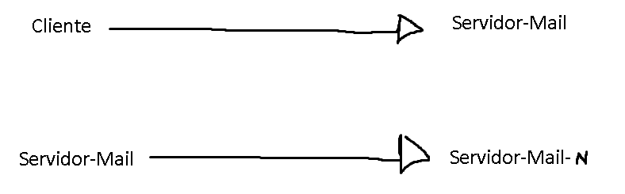

# tp4- Redes y Comunicaciones

---

1. ¿Qué protocolos se utilizan para el envío de mails entre el cliente y su servidor de
correo? ¿Y entre servidores de correo?

### 📤 Envío de mails **del cliente al servidor** de correo:

El protocolo principal es:

- **SMTP (Simple Mail Transfer Protocol)**:
    
    Es el protocolo que se usa para **enviar** correos electrónicos desde un cliente (como Outlook, Thunderbird o una app de mail) al servidor. También se usa entre servidores, ahora lo vemos.
    

> ✉️ Por ejemplo: cuando escribís un mail y tocás “Enviar”, tu cliente usa SMTP para mandarlo al servidor saliente.
> 

---

### 📬 Para **recibir** mails del servidor al cliente, se usan:

- **POP3 (Post Office Protocol, versión 3)**:
    
    Descarga los mails del servidor al dispositivo y por defecto los borra del servidor. Es más simple y consume menos recursos, pero no sirve mucho si querés acceder al mismo mail desde varios dispositivos.
    
- **IMAP (Internet Message Access Protocol)**:
    
    A diferencia de POP3, mantiene los mails en el servidor y sincroniza en tiempo real, ideal si usás el mail desde varios dispositivos (celu, compu, etc.).
    

> ✨ IMAP hoy en día es mucho más común que POP3.
> 

---

### 🔁 Entre **servidores de correo** (por ejemplo, cuando Gmail le manda un mail a Outlook):

- También se usa **SMTP**.
    
    Acá el protocolo se encarga de que el mensaje viaje de un servidor a otro hasta llegar al destinatario.
    

---

### Resumen:

| Acción | Protocolo |
| --- | --- |
| Enviar mail (cliente → servidor) | SMTP |
| Enviar mail (servidor → servidor) | SMTP |
| Recibir mail (servidor → cliente) | POP3 o IMAP |

1. ¿Qué protocolos se utilizan para la recepción de mails? Enumere y explique
características y diferencias entre las alternativas posibles.

### 📥 ¿Qué protocolos se utilizan para **la recepción de mails**?

Los dos protocolos principales son:

---

### 1. **POP3 (Post Office Protocol version 3)**

### 🧩 Características:

- **Conexión simple y directa**: el cliente se conecta al servidor, descarga los mails y (por defecto) los **elimina** del servidor.
- Guarda los correos **localmente** en tu dispositivo.
- No sincroniza cambios entre dispositivos (si borrás un mail en el celu, sigue estando en la compu).

### ✅ Ventajas:

- Menor uso de almacenamiento en el servidor.
- Ideal para usar con un solo dispositivo.

### ❌ Desventajas:

- No ves los mismos mails en varios dispositivos.
- Si perdés el dispositivo o no hacés copia, perdés los mails.

---

### 2. **IMAP (Internet Message Access Protocol)**

### 🧩 Características:

- Accedés a los correos **directamente en el servidor**.
- Sincronización en tiempo real entre varios dispositivos.
- Los cambios (leer, borrar, mover, etc.) se reflejan en todos los lugares donde accedas al correo.

### ✅ Ventajas:

- Perfecto para usar el mail desde distintos dispositivos.
- No perdés mails si se rompe tu compu o celular.

### ❌ Desventajas:

- Ocupa más espacio en el servidor.
- Requiere conexión estable a internet para funcionar bien.

---

### 🆚 Diferencias clave entre IMAP y POP3:

| Característica | POP3 | IMAP |
| --- | --- | --- |
| Almacenamiento | Local | En el servidor |
| Sincronización | No sincroniza | Sincroniza en tiempo real |
| Acceso desde varios equipos | Limitado | Totalmente posible |
| Uso de espacio en servidor | Menor | Mayor |
| Ideal para... | Un solo dispositivo | Varios dispositivos |

---

En resumen, **IMAP** es más moderno y flexible, y suele ser la opción por defecto hoy en día. **POP3** es más antiguo y limitado, aunque todavía se usa en casos específicos.

1. Utilizando la VM y teniendo en cuenta los siguientes datos, abra el cliente de correo
(Thunderbird) y configure dos cuentas de correo. Una de las cuentas utilizará POP para
solicitar al servidor los mails recibidos para la misma mientras que la otra utilizará IMAP.
Al crear cada una de las cuentas, seleccionar Manual config y luego de configurar las
mismas según lo indicado, ignorar advertencias por uso de conexión sin cifrado.
● Datos para POP
Cuenta de correo: [alumnopop@redes.unlp.edu.ar](mailto:alumnopop@redes.unlp.edu.ar)
Nombre de usuario: alumnopop
Contraseña: alumnopoppass
Puerto: 110
● Datos para IMAP
Cuenta de correo: [alumnoimap@redes.unlp.edu.ar](mailto:alumnoimap@redes.unlp.edu.ar)
Nombre de usuario: alumnoimap
Contraseña: alumnoimappass
Puerto: 143
● Datos comunes para ambas cuentas
Servidor de correo entrante (POP/IMAP):
• Nombre: [mail.redes.unlp.edu.ar](http://mail.redes.unlp.edu.ar/)
• SSL: None
• Autenticación: Normal password
Servidor de correo saliente (SMTP):
• Nombre: [mail.redes.unlp.edu.ar](http://mail.redes.unlp.edu.ar/)
• Puerto: 25
• SSL: None
• Autenticación: Normal password
a. Verificar el correcto funcionamiento enviando un email desde el cliente de
una cuenta a la otra y luego desde la otra responder el mail hacia la primera.
b. Análisis del protocolo SMTP
    
    i. Utilizando Wireshark, capture el tráfico de red contra el servidor de
    correo mientras desde la cuenta [alumnopop@redes.unlp.edu.ar](mailto:alumnopop@redes.unlp.edu.ar) envía
    un correo a [alumnoimap@redes.unlp.edu.ar](mailto:alumnoimap@redes.unlp.edu.ar)
    
    
    
    ii. Utilice el filtro SMTP para observar los paquetes del protocolo SMTP
    en la captura generada y analice el intercambio de dicho protocolo
    entre el cliente y el servidor para observar los distintos comandos
    utilizados y su correspondiente respuesta. Ayuda: filtre por protocolo
    SMTP y sobre alguna de las líneas del intercambio haga click derecho
    y seleccione Follow TCP Stream. . .
    
    
    

c. Usando el cliente de correo Thunderbird del usuario
[alumnopop@redes.unlp.edu.ar](mailto:alumnopop@redes.unlp.edu.ar) envíe un correo electrónico
[alumnoimap@redes.unlp.edu.ar](mailto:alumnoimap@redes.unlp.edu.ar) el cual debe tener: un asunto, datos en el
body y una imagen adjunta.
i. Verifique las fuentes del correo recibido para entender cómo se utiliza
el header “Content-Type: multipart/mixed“ para poder realizar el envío
de distintos archivos adjuntos.
ii. Extraiga la imagen adjunta del mismo modo que lo hace el cliente de
correo a partir de los fuentes del mensaje.

zzzz

---

### **7. ¿Es posible enviar más de un correo durante una misma conexión TCP?**

### 📩 **Sí, es posible**. Esto depende del **protocolo SMTP**, que permite mantener una conexión abierta para enviar múltiples correos.

---

### **Casos:**

### **a) MUA → MSA (Mail User Agent → Mail Submission Agent)**

- ✅ **Múltiples destinatarios del mismo dominio:**
    
    Sí, se puede usar **una sola conexión TCP**.
    
    El MUA puede enviar todos los destinatarios dentro del mismo `RCPT TO:` y luego enviar el `DATA` una sola vez.
    
- ✅ **Múltiples destinatarios de distintos dominios:**
    
    Técnicamente se puede intentar enviar todos en una sola sesión, pero **el MSA probablemente divida luego el envío por dominio**.
    
    Algunos MSA pueden requerir **una nueva conexión** por dominio, dependiendo de la configuración de seguridad o políticas de relay.
    

---

### **b) MTA → MTA (Mail Transfer Agent → otro MTA)**

- ✅ **Mismo dominio de destino:**
    
    **Sí**, el MTA puede reutilizar una sola conexión TCP para enviar múltiples correos al mismo servidor de destino.
    
- ⚠️ **Distintos dominios:**
    
    **No**, normalmente se abre **una conexión distinta por dominio**, ya que se resuelven a diferentes servidores MX (Mail Exchange) vía DNS.
    

---

### **8. ¿Puede un MSA escuchar en un puerto diferente a los convencionales (25, 587)?**

### ✅ **Sí, es técnicamente posible**, pero tiene implicancias:

- **Los puertos estándar para MSA son:**
    - **587 (con autenticación y STARTTLS)**
    - **465 (con SSL/TLS directo)**
- **Implicancias de usar otro puerto:**
    - El MUA (cliente de correo) debe estar **configurado explícitamente** para ese puerto.
    - Algunos **proveedores de Internet o firewalls bloquean puertos no estándar**, lo que puede dificultar la conectividad.
    - No es compatible con clientes configurados por defecto.

📌 **Útil en entornos cerrados** o para evitar filtros de tráfico.

---

### **9. ¿Puede un MTA escuchar en un puerto diferente al estándar (25)?**

### ✅ **También es posible**, pero más problemático.

- **Puerto estándar para MTA es el 25.**
- **Implicancias:**
    - Otros servidores que quieran entregar correos a ese MTA **esperan encontrarlo en el puerto 25**.
    - Si se usa otro puerto, **los correos no llegarán salvo que se configure específicamente cada remitente para usar el nuevo puerto**, lo cual **no es viable a gran escala**.

📌 **Conclusión:** aunque técnicamente se puede cambiar, en la práctica **un MTA debe escuchar en el puerto 25** para interoperar correctamente con otros servidores.

---

1. Ejercicio integrador HTTP, DNS y MAIL
Suponga que registró bajo su propiedad el dominio [redes2024.com.ar](http://redes2024.com.ar/) y dispone de 4
servidores:
● Un servidor DNS instalado configurado como primario de la zona
[redes2024.com.ar](http://redes2024.com.ar/). (hostname: ns1 - IP: 203.0.113.65).
● Un servidor DNS instalado configurado como secundario de la zona
[redes2024.com.ar](http://redes2024.com.ar/). (hostname: ns2 - IP: 203.0.113.66).
    
    ● Un servidor de correo electrónico (hostname: mail - IP: 203.0.113.111).
    Permitirá a los usuarios envíar y recibir correos a cualquier dominio de Internet.
    ● Un servidor WEB para el acceso a un webmail (hostname: correo - IP:
    203.0.113.8). Permitirá a los usuarios gestionar vía web sus correos
    electrónicos a través de la URL [https://webmail.redes2024.com.a](https://webmail.redes2024.com.a/)
    

a. ¿Qué información debería informar al momento del registro para hacer visible a Internet el dominio registrado?
Para que sea visible el dominio [redes2024.com.ar](http://redes2024.com.ar) deberia avisarle al servidor Autoritativo para que lo registre bajo el dominio redes2024.com.ar                 [ ns1, ns2]

b. ¿Qué registros sería necesario configurar en el servidor de nombres? Indique
toda la información necesaria del archivo de zona. Puede utilizar la siguiente
tabla de referencia (evalúe la necesidad de usar cada caso los siguientes
campos): Nombre del registro, Tipo de registro, Prioridad, TTL, Valor del
registro.

PREGUNTAR EL JUEVES ACA, EL TTL COMO SE QUE TTL SERIA MEJOR PARA CADA CASO??? QUE CRITERIO DEBERIA ELEGIR

c. ¿Es necesario que el servidor de DNS acepte consultas recursivas?
Justifique.
d. ¿Qué servicios/protocolos de capa de aplicación configuraría en cada
servidor?
e. Para cada servidor, ¿qué puertos considera necesarios dejar abiertos a
Internet?. A modo de referencia, para cada puerto indique: servidor, protocolo
de transporte y número de puerto.
f. ¿Cómo cree que se conectaría el webmail del servidor web con el servidor de
correo? ¿Qué protocolos usaría y para qué?
g. ¿Cómo se podría hacer para que cualquier MTA reconozca como válidos los
mails provenientes del dominio [redes2024.com.ar](http://redes2024.com.ar/) solamente a los que llegan
de la dirección 203.0.113.111? ¿Afectaría esto a los mails enviados desde el
Webmail? Justifique.
h. ¿Qué característica propia de SMTP, IMAP y POP hace que al adjuntar una
imagen o un ejecutable sea necesario aplicar un encoding (ej. base64)?
i. ¿Se podría enviar un mail a un usuario de modo que el receptor vea que el
remitente es un usuario distinto? En caso afirmativo, ¿Cómo? ¿Es una
indicación de una estafa? Justifique
j. ¿Se podría enviar un mail a un usuario de modo que el receptor vea que el
destinatario es un usuario distinto? En caso afirmativo, ¿Cómo? ¿Por qué no
le llegaría al destinatario que el receptor ve? ¿Es esto una indicación de una
estafa? Justifique

k. ¿Qué protocolo usará nuestro MUA para enviar un correo con remitente
[redes@info.unlp.edu.ar](mailto:redes@info.unlp.edu.ar)? ¿Con quién se conectará? ¿Qué información será
necesaria y cómo la obtendría?
l. Dado que solo disponemos de un servidor de correo, ¿qué sucederá con los
mails que intenten ingresar durante un reinicio del servidor?
m. Suponga que contratamos un servidor de correo electrónico en la nube para
integrarlo con nuestra arquitectura de servicios.
i. ¿Cómo configuraría el DNS para que ambos servidores de correo se
comporten de manera de dar un servicio de correo tolerante a fallos?